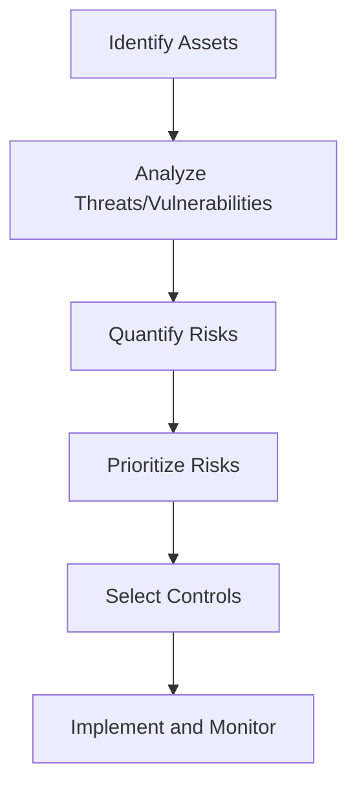

## Understanding Risk Assessment in ISO 27001  

Risk assessment is a foundational activity in ISO 27001, forming the basis for identifying, analyzing, and prioritizing information security risks. It enables organizations to understand their exposure to threats, evaluate the likelihood and impact of potential security incidents, and make informed decisions about implementing controls to mitigate risks. This process is critical for aligning the Information Security Management System (ISMS) with organizational objectives, regulatory requirements, and stakeholder expectations.  

### Purpose of Risk Assessment in ISO 27001  
The primary purpose of risk assessment in ISO 27001 is to:  
1. **Identify information assets** and their associated risks.  
2. **Evaluate threats** and vulnerabilities that could compromise these assets.  
3. **Quantify risks** using a structured methodology to prioritize remediation efforts.  
4. **Support decision-making** for selecting and implementing appropriate controls.  

This process ensures that resources are allocated efficiently to address the most significant risks, balancing security needs with operational and financial constraints.  

### Key Components of Risk Assessment  
A comprehensive risk assessment in ISO 27001 involves three core components:  
1. **Asset Identification**:  
   - Catalogue information assets (e.g., data, systems, networks) and their criticality to business operations.  
   - Example: A healthcare organization might prioritize patient records as high-value assets.  

2. **Threat and Vulnerability Analysis**:  
   - Identify potential threats (e.g., cyberattacks, insider risks) and vulnerabilities (e.g., unpatched software, weak access controls).  
   - Use tools like vulnerability scanners (e.g., Nessus) or threat intelligence feeds to gather data.  

3. **Risk Evaluation**:  
   - Calculate risk levels using a formula such as:  
     ```python  
     risk = probability_of_threat * impact_of_vulnerability  
     ```  
   - Classify risks as **high**, **medium**, or **low** based on thresholds (e.g., risk > 10 = high).  

### Risk Evaluation Process  
The risk evaluation process typically follows these steps:  
1. **Risk Identification**: List all potential risks to information assets.  
2. **Risk Analysis**: Assess the likelihood and impact of each risk.  
3. **Risk Prioritization**: Rank risks based on their potential impact and likelihood.  
4. **Risk Treatment**: Determine actions to mitigate, transfer, accept, or avoid risks.  

A **risk matrix** is often used to visualize this process, plotting risk likelihood against impact to categorize risks visually.  

### Integration with ISO 27001  
Risk assessment in ISO 27001 is integrated into the broader risk management framework:  
- **ISO 27005** provides guidance on risk assessment methodologies and tools.  
- The results of the risk assessment feed into the **risk treatment plan**, which informs the selection of controls (e.g., encryption, access controls).  
- Continuous monitoring and periodic reassessment are required to adapt to evolving threats and organizational changes.  

### Example: Risk Assessment Workflow  

This workflow illustrates how risk assessment aligns with the ISO 27001 lifecycle, ensuring risks are systematically addressed.  

## Key takeaways  
- Risk assessment identifies and evaluates information security risks to inform control decisions.  
- It involves identifying assets, threats, vulnerabilities, and quantifying risks through structured methodologies.  
- Continuous monitoring and updating are essential for maintaining an effective ISMS.  
- Integration with ISO 27001 ensures alignment with organizational objectives and regulatory requirements.  
- Risk assessment is a foundational step in establishing and maintaining an ISMS.
