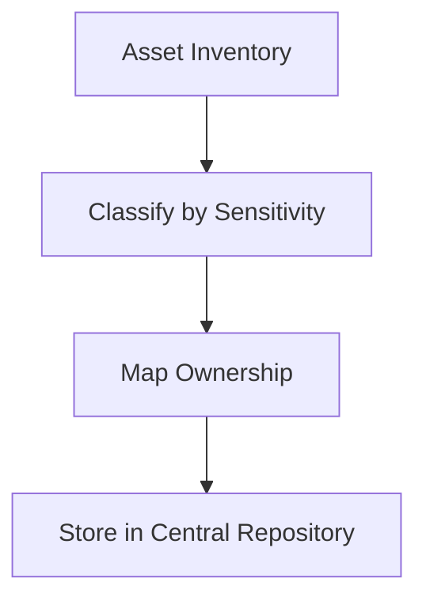
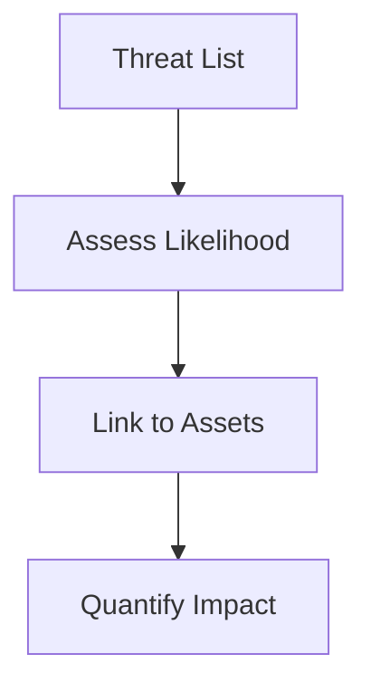
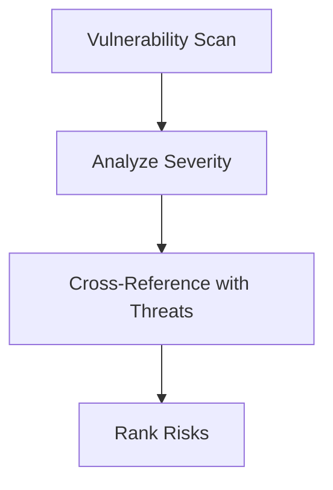

## Conducting a Risk Assessment Process  

A risk assessment is the cornerstone of establishing an Information Security Management System (ISMS) under ISO 27001. It involves systematically identifying, analyzing, and evaluating risks to organizational assets, ensuring alignment with compliance frameworks like GDPR, PCI DSS, and SOC 2. This process enables prioritization of controls and resource allocation to mitigate threats effectively.  

---

### **1. Asset Identification**  
**Objective**: Catalog all assets critical to organizational operations, including data, systems, and infrastructure.  

**Steps**:  
- **Inventory assets**: Identify physical (servers, devices) and digital (databases, applications) assets.  
- **Classify assets**: Assign sensitivity levels (e.g., public, internal, confidential) and criticality (e.g., high, medium, low).  
- **Map ownership**: Link assets to responsible teams or individuals.  

**Example**:  
```bash
# Use a script to inventory network devices (example for Linux systems)
nmap -sP 192.168.1.0/24 | tee asset_inventory.txt
```

**Diagram**:  


---

### **2. Threat Analysis**  
**Objective**: Identify potential threats and their sources that could exploit vulnerabilities.  

**Steps**:  
- **List threats**: Categorize threats (e.g., cyberattacks, natural disasters, insider threats).  
- **Assess likelihood**: Use qualitative (high/medium/low) or quantitative (probability percentages) methods.  
- **Link to assets**: Determine which assets are most vulnerable to each threat.  

**Example**:  
```python
# Sample threat matrix (simplified)
threats = {
    "Malware": {"likelihood": "High", "impact": "Critical"},
    "Data Breach": {"likelihood": "Medium", "impact": "Critical"},
    "Insider Threat": {"likelihood": "Low", "impact": "High"}
}
```  

**Diagram**:  


---

### **3. Vulnerability Evaluation**  
**Objective**: Assess weaknesses in systems, processes, or human behavior that could be exploited.  

**Steps**:  
- **Scan for vulnerabilities**: Use tools like Nmap, Nessus, or OpenVAS.  
- **Prioritize risks**: Combine vulnerability severity (CVSS scores) with threat likelihood.  
- **Validate findings**: Cross-check with penetration testing or log analysis.  

**Example**:  
```bash
# Scan for open ports and services using Nmap
nmap -sV 192.168.1.100 | tee vulnerability_report.txt
```  

**Diagram**:  


---

### **4. Risk Evaluation**  
**Objective**: Determine the significance of risks using a risk matrix.  

**Steps**:  
- **Calculate risk score**: Use a formula like `Risk = Likelihood × Impact`.  
- **Categorize risks**: Define thresholds for "acceptable," "treat," or "mitigate" risks.  
- **Document findings**: Record all risks, their scores, and initial treatment plans.  

**Example**:  
```excel
| Risk          | Likelihood | Impact | Risk Score | Treatment |
|---------------|------------|--------|------------|-----------|
| Data Breach   | High       | Critical | 10         | Mitigate  |
| Server Downtime | Medium    | High    | 6          | Accept    |
```  

---

### **5. Risk Treatment Planning**  
**Objective**: Define actions to reduce risks to acceptable levels.  

**Options**:  
- **Mitigation**: Implement controls (e.g., firewalls, encryption).  
- **Transfer**: Outsource risks (e.g., insurance, third-party contracts).  
- **Accept**: Acknowledge risks without action (for low-impact threats).  
- **Avoid**: Discontinue high-risk activities.  

**Example**:  
```bash
# Automate control implementation (e.g., enforce password policies)
sudo apt install fail2ban
sudo systemctl enable fail2ban
```  

---

## Key takeaways  
- **Systematic approach**: Risk assessment must align with ISO 27001’s risk management framework.  
- **Tools matter**: Use asset inventories, vulnerability scanners, and threat matrices for structured analysis.  
- **Continuous monitoring**: Regularly update assessments to reflect evolving threats and compliance requirements.  
- **Integration**: Link findings to standards like GDPR (data protection) and PCI DSS (payment security).  
- **Documentation**: Maintain detailed records for audits and stakeholder reporting.
