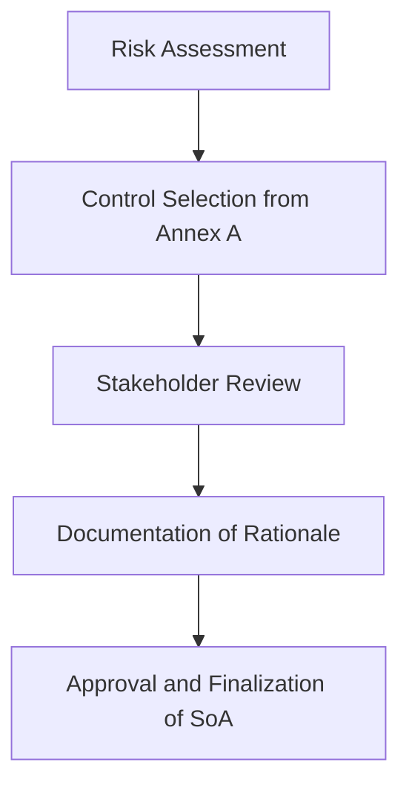

The **Statement of Applicability (SoA)** is a foundational document in the ISO 27001 ISMS implementation, serving as the bridge between the generic controls in Annex A and the organization’s unique risk landscape. It ensures that the Information Security Management System (ISMS) is both effective and proportionate to the organization’s specific context, threats, and operational requirements. The SoA is not a static list of controls but a dynamic, evidence-based decision-making process that aligns with the organization’s risk appetite, legal obligations, and business objectives.

---

## Purpose of the Statement of Applicability  
The primary purpose of the SoA is to:  
1. **Select and tailor controls** from Annex A based on the organization’s risk assessment, regulatory requirements, and operational environment.  
2. **Document the rationale** for including, excluding, or modifying controls to ensure transparency and accountability.  
3. **Align the ISMS with the organization’s risk treatment strategy**, ensuring that controls are neither over- nor under-optimized.  
4. **Provide a basis for audit and certification**, demonstrating that the ISMS is both compliant and contextually relevant.  

For example, a small business may exclude control A.12.1.2 (encryption of data at rest) if its risk assessment determines that data at rest is not a critical asset, while a financial institution would likely include it due to regulatory and operational risks.

---

## Scope of the Statement of Applicability  
The SoA must cover:  
- **All controls in Annex A** (e.g., A.5.1.1 for access control, A.12.1.1 for encryption).  
- **Exclusions or modifications** to controls, with clear justification (e.g., "Control A.12.1.2 is not applicable due to the use of third-party cloud storage with built-in encryption").  
- **Rationale for decisions**, including references to risk assessments, legal requirements, or stakeholder input.  
- **Stakeholder involvement**, ensuring that business units, IT, and compliance teams agree on the applicability of controls.  

The scope also extends to documenting **control dependencies** (e.g., implementing A.9.2.1 requires A.5.1.1) and **performance metrics** to measure control effectiveness.

---

## Example: Control Applicability Decision  
```markdown
| Control ID | Applicability | Rationale |  
|------------|---------------|-----------|  
| A.5.1.1 | ✅ Yes | Required to enforce least-privilege access for internal systems. |  
| A.12.1.2 | ❌ No | Data at rest is encrypted by third-party cloud providers. |  
| A.16.1.2 | ✅ Yes | Compliance with GDPR data retention policies. |  
```

---

## Diagram: SoA Development Process  


---

## Key takeaways  
- The SoA ensures controls are **tailored to the organization’s unique risks and context**.  
- It must **document decisions** for inclusion, exclusion, or modification of controls.  
- **Stakeholder collaboration** is critical to validate the SoA’s alignment with business and compliance needs.  
- The SoA serves as a **foundation for audit, certification, and continuous improvement** of the ISMS.  
- Regular reviews of the SoA are necessary to adapt to changes in the organization’s environment or regulatory landscape.
