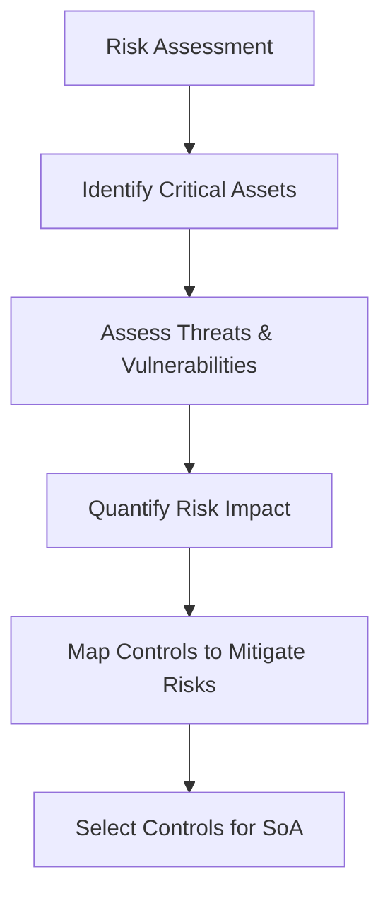

## Selecting Controls for the Statement of Applicability  

The Statement of Applicability (SoA) is the cornerstone of ISO 27001 implementation, defining which controls from Annex A are relevant to an organization’s risk profile and operational context. Selecting controls requires a structured approach that balances risk mitigation, regulatory obligations, and resource constraints. Below are the key criteria and considerations for this process.  

---

### 1. **Risk Assessment Alignment**  
Controls must directly address risks identified during the risk assessment phase. For example:  
- **High-risk areas** (e.g., data breaches, system vulnerabilities) require mandatory controls like *A.12.1.1* (information security incident management) or *A.13.2.1* (penetration testing).  
- **Low-risk areas** may warrant optional controls, such as *A.8.2.2* (data backup) if the organization’s risk appetite permits.  

**Example:**  
```bash
# Sample script to prioritize controls based on risk scores  
# (Risk scores: 1 = Low, 3 = Medium, 5 = High)  
SELECT control_id, risk_score  
FROM controls  
WHERE risk_score >= 3  
ORDER BY risk_score DESC;
```  

**Diagram:**  


---

### 2. **Regulatory and Compliance Requirements**  
Organizations must include controls that align with legal obligations (e.g., GDPR, PCI DSS, SOC 2). For instance:  
- **GDPR compliance** may necessitate *A.17.2.1* (data protection impact assessments).  
- **PCI DSS v4.0** mandates *A.12.2.1* (incident response for payment data breaches).  

**Example:**  
```sql
-- Query to enforce mandatory controls for GDPR compliance  
SELECT control_id, control_description  
FROM controls  
WHERE control_id IN ('A.17.2.1', 'A.17.2.2')  
AND compliance_required = TRUE;
```  

---

### 3. **Resource Availability and Feasibility**  
Controls must be practical given the organization’s:  
- **Budget**: High-cost controls (e.g., encryption for all data) may require phased implementation.  
- **Expertise**: Controls requiring specialized skills (e.g., *A.16.1.2* for cryptographic key management) may need training or outsourcing.  
- **Time**: Prioritize controls with quick ROI, such as *A.8.1.1* (data classification).  

**Example:**  
```bash
# Prioritize controls with minimal implementation effort  
# (e.g., for small businesses with limited IT staff)  
SELECT control_id, control_description  
FROM controls  
WHERE implementation_effort <= 'medium'  
ORDER BY implementation_effort ASC;
```  

---

### 4. **Cost-Benefit Analysis**  
Evaluate the balance between control effectiveness and cost. For example:  
- **High-impact controls** (e.g., *A.12.1.1*) may justify higher investment despite complexity.  
- **Low-impact controls** (e.g., *A.14.1.1* for physical security) may be deferred if resources are constrained.  

---

### 5. **Scalability and Future-Proofing**  
Choose controls that adapt to evolving threats and business needs. For example:  
- **Automated controls** (e.g., *A.12.2.1*) reduce long-term maintenance costs.  
- **Modular controls** (e.g., *A.17.2.1*) allow incremental updates as regulations change.  

---

## Key takeaways  
- **Align controls with risk assessment outcomes** to prioritize high-impact threats.  
- **Incorporate regulatory requirements** to ensure compliance with GDPR, PCI DSS, etc.  
- **Balance feasibility and cost** to avoid overcommitting resources.  
- **Prioritize scalability** to adapt to future risks and technological changes.  
- **Document decisions rigorously** in the SoA to justify control selection to auditors and stakeholders.
