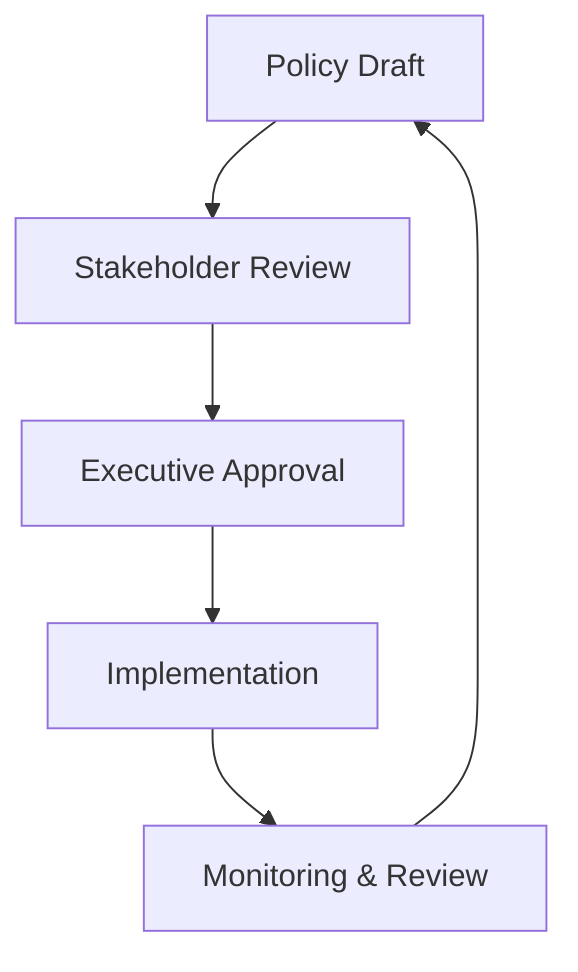
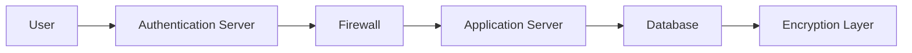
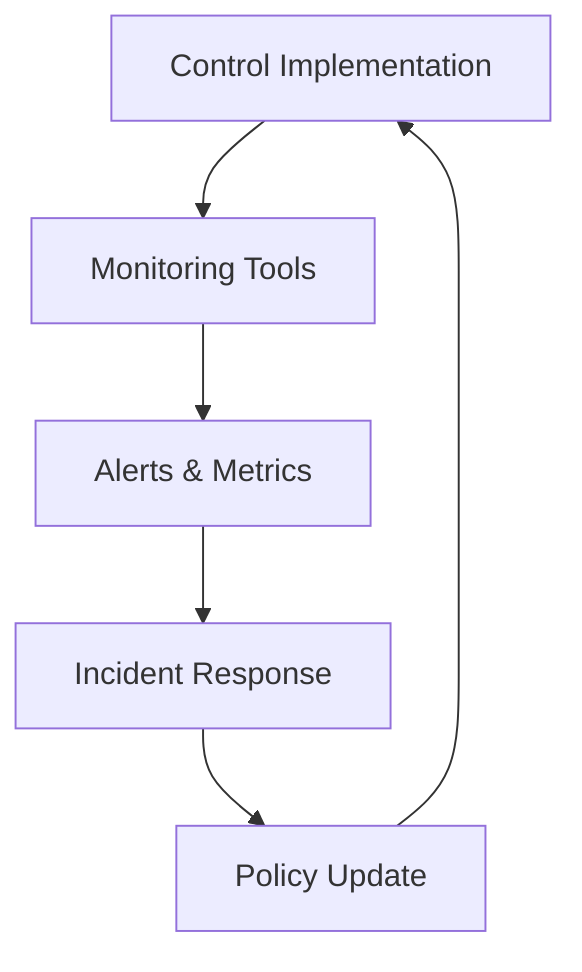

## Implementing Control Objects and Practices  

Implementing control objects and practices in an ISO 27001 ISMS requires a structured approach that balances policy creation, technical configuration, and continuous monitoring. Controls must align with the organization’s risk appetite, regulatory requirements (e.g., GDPR, PCI DSS), and operational needs. This section outlines practical steps for deploying controls, including policy templates, technical configurations, and integration with compliance frameworks like NIST CSF and SOC 2.  

---

### ## Policy Creation and Documentation  

Policies form the foundation of control implementation. They define roles, responsibilities, and procedures for managing risks.  

#### **Steps for Policy Creation**  
1. **Define Objectives**: Align policies with ISO 27001 Annex A controls (e.g., A.8 for access control).  
2. **Draft Templates**: Use standardized templates for access control, data classification, and incident response.  
3. **Approve and Distribute**: Secure executive approval and ensure policies are accessible to all stakeholders.  

#### **Example: Access Control Policy Template**  
```markdown
# Access Control Policy  
**Purpose**: Ensure authorized access to information assets.  
**Scope**: All employees, contractors, and third-party systems.  
**Responsibilities**:  
- IT Security Team: Configure access controls.  
- Users: Adhere to access privileges.  
**Procedures**:  
- Role-based access (RBAC) must be documented.  
- Regular access reviews (quarterly).  
```  

#### **Diagram: Policy Lifecycle**  


---

### ## Technical Configuration and Automation  

Technical controls must be configured to enforce policies and meet compliance requirements (e.g., PCI DSS v4.0, SOC 2). Automation tools streamline deployment and reduce human error.  

#### **Key Technical Steps**  
1. **Enable Encryption**: Use AES-256 for data at rest and TLS 1.3 for data in transit.  
2. **Configure Firewalls**: Implement rule-based filtering (e.g., deny-by-default).  
3. **Automate Compliance Checks**: Use tools like Ansible or Terraform for consistent configurations.  

#### **Example: SSH Access Control via Ansible**  
```bash
# Ansible playbook to restrict SSH access
- name: Configure SSH access
  hosts: all
  tasks:
    - name: Set SSH port to 2222
      lineinfile:
        path: /etc/ssh/sshd_config
        line: 'Port 2222'
        state: present
    - name: Restart SSH service
      service:
        name: ssh
        state: restarted
```  

#### **Diagram: Technical Architecture with Controls**  


---

### ## Monitoring, Maintenance, and Continuous Improvement  

Controls must be monitored for effectiveness and updated to address evolving risks.  

#### **Monitoring Practices**  
- **Log Analysis**: Use SIEM tools (e.g., Splunk, ELK Stack) to detect anomalies.  
- **Regular Audits**: Conduct quarterly reviews of access logs and policy adherence.  

#### **Example: Log Analysis Script**  
```bash
# Identify failed login attempts in /var/log/auth.log
grep "Failed password" /var/log/auth.log | awk '{print $11}' | sort | uniq -c | sort -nr | head -n 10
```  

#### **Continuous Improvement**  
- **Feedback Loops**: Integrate incident reports into policy revisions.  
- **Training**: Update staff on new controls and compliance requirements (e.g., GDPR data minimization).  

#### **Diagram: Monitoring and Feedback Loop**  


---

## Key takeaways  
- **Policy creation** must align with ISO 27001 Annex A controls and regulatory standards.  
- **Technical configurations** (e.g., encryption, access controls) should be automated for consistency.  
- **Monitoring and audits** ensure controls remain effective and compliant with evolving risks.  
- **Documentation and feedback loops** are critical for continuous improvement in control implementation.
