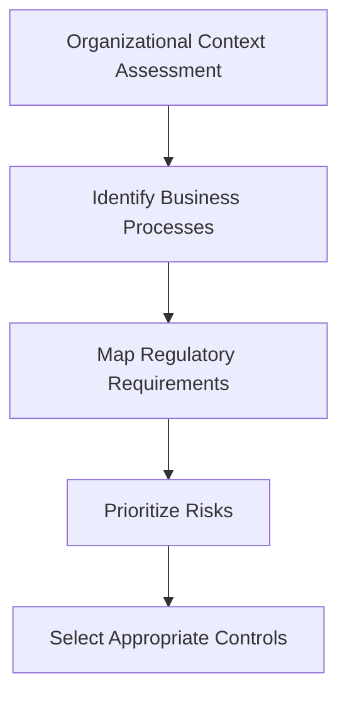
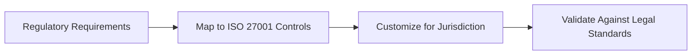
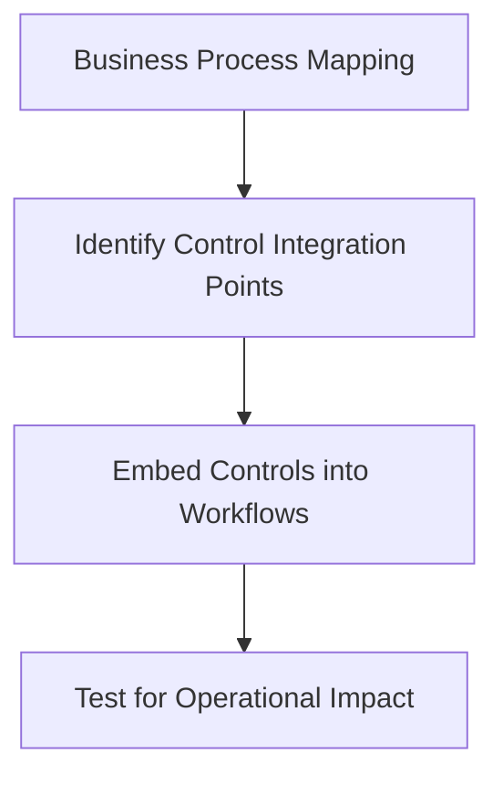
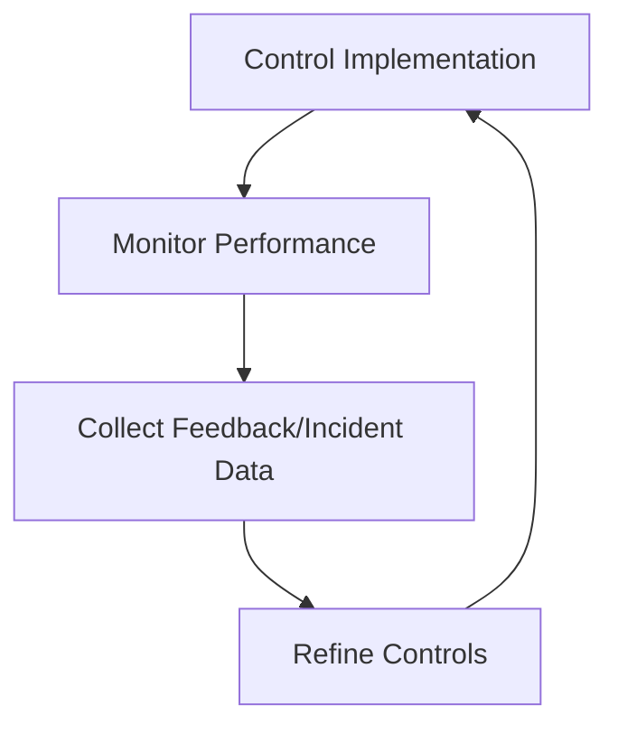

## Tailoring Controls to Organizational Needs  

Implementing ISO 27001 controls requires more than a one-size-fits-all approach. Organizations must adapt controls to align with their unique business processes, regulatory obligations, and risk profiles. This section outlines strategies for tailoring controls to ensure they are practical, effective, and compliant with frameworks like GDPR, PCI DSS, and SOC 2.  

---

### 1. Assessing Organizational Context  
Before tailoring controls, conduct a thorough assessment of your organization’s size, industry, and operational complexity. Use tools like risk assessment matrices to prioritize controls based on threat likelihood and impact.  

**Example:**  
```markdown
| Risk Category       | Likelihood | Impact | Control Priority |
|---------------------|------------|--------|------------------|
| Data Breach         | High       | Critical | High             |
| Insider Threat      | Medium     | High   | Medium           |
| Third-Party Risks   | Low        | Medium | Low              |
```  

**Diagram:**  


---

### 2. Aligning with Regulatory Requirements  
Tailor controls to meet specific regulatory mandates. For example:  
- **GDPR:** Implement data minimization and breach notification protocols.  
- **PCI DSS:** Enforce secure payment processing and regular vulnerability scans.  
- **SOC 2:** Focus on data availability, processing integrity, and confidentiality.  

**Example:**  
```markdown
## GDPR Compliance Policy Template  
**Scope:** All EU data processing activities.  
**Controls:**  
- Data Protection Impact Assessments (DPIAs) for high-risk processing.  
- Encryption of sensitive data at rest and in transit.  
- Annual employee training on data privacy.  
```  

**Diagram:**  


---

### 3. Integrating with Business Processes  
Embed controls into daily operations without disrupting workflows. For instance:  
- **Procurement:** Require vendors to sign SLAs with data security clauses.  
- **IT Operations:** Automate patch management and access reviews.  
- **HR:** Integrate role-based access control (RBAC) with employee onboarding.  

**Example:**  
```bash
# Automate access review using a script (pseudo-code)  
#!/bin/bash  
find /var/log/ -name "*.log" -mtime +30 -exec rm -f {} \;  
auditctl -p /etc/audit/audit.rules  
```  

**Diagram:**  


---

### 4. Continuous Review and Adaptation  
Controls must evolve with changing threats and organizational goals. Establish a review cycle (e.g., quarterly) and use metrics like incident rates or audit findings to refine controls.  

**Example:**  
```markdown
## Control Review Schedule  
- **Quarterly:** Evaluate effectiveness of access controls and incident response.  
- **Annually:** Update policies to reflect new regulations (e.g., GDPR amendments).  
- **Post-Incident:** Conduct root cause analysis and adjust controls accordingly.  
```  

**Diagram:**  


---

## Key takeaways  
- **Tailor controls** to match organizational size, industry, and regulatory landscape.  
- **Prioritize risks** using a structured assessment framework.  
- **Integrate controls** seamlessly into business processes to avoid operational friction.  
- **Regularly review and update** controls to address emerging threats and compliance changes.
