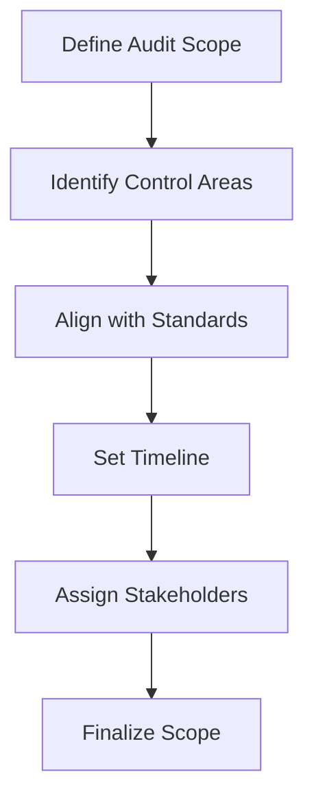
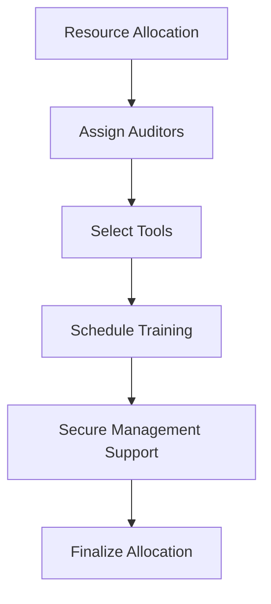

## Planning Internal Audits for ISMS  

Internal audit planning is a foundational step in ensuring the effectiveness and efficiency of your Information Security Management System (ISMS) under ISO 27001. This phase establishes the framework for evaluating compliance, identifying risks, and verifying the adequacy of controls. Proper planning ensures alignment with ISO 27001 requirements, such as Clause 9.2 (Internal Audit) and Annex A.1.2 (Audit and Management Review).  

---

### 1. Defining Audit Scope  
The scope defines the boundaries of the audit, ensuring it aligns with organizational objectives and ISMS requirements. Key considerations include:  
- **Control areas**: Focus on specific policies, procedures, or technical controls (e.g., access management, incident response).  
- **Regulatory alignment**: Ensure compliance with standards like GDPR, PCI DSS, or SOC 2 where applicable.  
- **Timeline**: Set clear start and end dates, considering the audit cycle (e.g., annual reviews).  
- **Stakeholders**: Identify key personnel (e.g., IT, security teams, management) and their roles.  

**Example**:  
```markdown
## Audit Scope Template  
- **Objective**: Verify compliance with ISO 27001:2022 Clause 9.2 and Annex A.1.2.  
- **Control Areas**: Access control, incident management, and data encryption.  
- **Timeline**: Q3 2023 (August–October).  
- **Stakeholders**: IT Security Team, Compliance Officer, and Management.  
```  

**Diagram**:  


---

### 2. Resource Allocation  
Effective resource allocation ensures the audit team has the tools, expertise, and support to achieve its objectives. Key steps include:  
- **Team composition**: Assign auditors with relevant expertise (e.g., cybersecurity, compliance).  
- **Tools and documentation**: Use audit checklists, risk assessment templates, and record-keeping tools.  
- **Training**: Ensure auditors are trained in ISO 27001 principles and audit methodologies.  
- **Management support**: Secure buy-in from leadership to prioritize audit activities.  

**Example**:  
```bash
# Command to create an audit resource allocation plan  
echo "## Resource Allocation Plan" > audit-plan.md  
echo "- **Auditors**: John Doe (Cybersecurity), Jane Smith (Compliance)" >> audit-plan.md  
echo "- **Tools**: ISO 27001 Checklist v2.0, Risk Matrix Template" >> audit-plan.md  
echo "- **Training**: Mandatory ISO 27001 audit workshop (Date: 2023-08-15)" >> audit-plan.md  
```  

**Diagram**:  


---

### 3. Documentation and Risk Assessment  
Documenting the audit plan and conducting a preliminary risk assessment ensures clarity and preparedness. This includes:  
- **Audit plan**: A detailed document outlining scope, objectives, and methodology.  
- **Risk assessment**: Identify potential risks (e.g., non-compliance, resource gaps) and mitigation strategies.  

**Example**:  
```markdown
## Preliminary Risk Assessment  
| Risk | Impact | Likelihood | Mitigation |  
|------|--------|------------|------------|  
| Non-compliance with GDPR | High | Medium | Conduct GDPR-specific audit |  
| Auditor resource shortage | Medium | Low | Cross-train IT and compliance teams |  
```  

---

## Key takeaways  
- **Scope definition** ensures audits are focused, compliant, and aligned with ISO 27001 requirements.  
- **Resource allocation** balances expertise, tools, and stakeholder engagement to achieve audit goals.  
- **Documentation** and **risk assessment** provide clarity, reduce surprises, and support continuous improvement.  
- Regularly revisit the audit plan to adapt to evolving standards (e.g., ISO 27001:2022 updates) and organizational changes.
