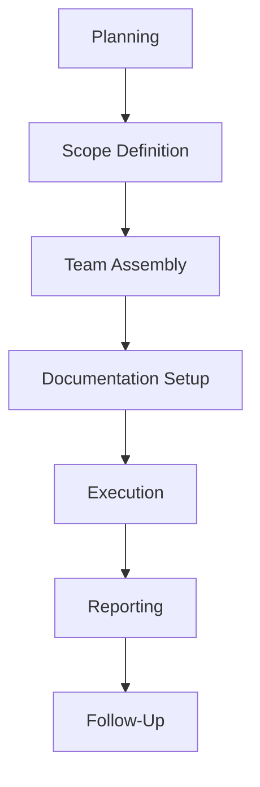

## Planning the Audit  
Effective ISMS audits begin with meticulous planning. Define audit objectives, scope, and criteria aligned with ISO 27001 requirements (e.g., Clause 8.2 for internal audits). Assemble a cross-functional audit team with expertise in IT, risk management, and compliance. Use tools like **Microsoft Excel** or **AuditBoard** to create a risk-based audit plan, prioritizing areas with high risk or regulatory exposure.  

**Example command for audit planning:**  
```bash
# Generate a risk-based audit checklist using a script  
echo "Audit Checklist:" > audit_checklist.txt  
echo "- Review ISO 27001 Clause 8.2 compliance" >> audit_checklist.txt  
echo "- Assess access control policies (ISO 27001 Clause 11.2)" >> audit_checklist.txt  
echo "- Verify incident management processes (ISO 27001 Clause 10.2)" >> audit_checklist.txt  
```  

**Diagram:**  


---

## Evidence Collection Techniques  
Collect objective, verifiable evidence to validate ISMS controls. Use a combination of **document reviews**, **interviews**, and **technical assessments**. For example:  
- **Document reviews**: Check policy versions, risk registers, and incident reports.  
- **Interviews**: Engage with staff to assess awareness and process adherence.  
- **Technical tools**: Use **Nessus** or **OpenVAS** to scan for vulnerabilities, or **SIEM systems** to analyze log data.  

**Example command for vulnerability scanning:**  
```bash  
# Run a vulnerability scan using OpenVAS  
openvas --scanner "OpenVAS Scanner" --target "192.168.1.0/24" --report "vulnerability_report.html"  
```  

**Example checklist:**  
| Control | Evidence Required |  
|--------|-------------------|  
| Access controls | Password policies, role-based permissions |  
| Incident response | Escalation procedures, past incident logs |  

---

## Compliance Checks and Risk Assessment  
Map audit findings to ISO 27001 clauses and assess whether controls meet regulatory requirements. For example:  
- **PCI DSS v4.0**: Verify tokenization and encryption of cardholder data.  
- **GDPR**: Ensure data minimization and breach notification processes.  

**Example compliance check:**  
```bash  
# Validate GDPR compliance by checking data retention policies  
grep "data retention" /opt/gdpr_policies/retention_policy.md  
```  

Use **risk matrices** to evaluate the likelihood and impact of non-compliance. Highlight gaps in controls and prioritize remediation.  

---

## Audit Reporting and Follow-Up  
Structure audit reports to include:  
1. **Findings**: Clearly describe non-conformities (e.g., "Access logs not archived per ISO 27001 Clause 11.3").  
2. **Recommendations**: Propose actionable fixes (e.g., "Implement automated log archiving").  
3. **Follow-Up**: Schedule re-audits to verify remediation.  

**Example report snippet:**  
```markdown  
## Non-Conformity: Access Control Gaps  
**Clause**: ISO 27001 11.2  
**Evidence**: Missing role-based access in server configurations  
**Recommendation**: Deploy IAM solution with RBAC enforcement  
```  

---

## Key takeaways  
- **Plan audits** with clear objectives and risk-based prioritization.  
- **Collect diverse evidence** (documents, interviews, technical data) to validate controls.  
- **Map findings** to specific standards (e.g., ISO 27001 clauses, GDPR articles).  
- **Report non-conformities** clearly and prioritize remediation.  
- **Leverage tools** like OpenVAS or SIEM systems to streamline evidence gathering.
