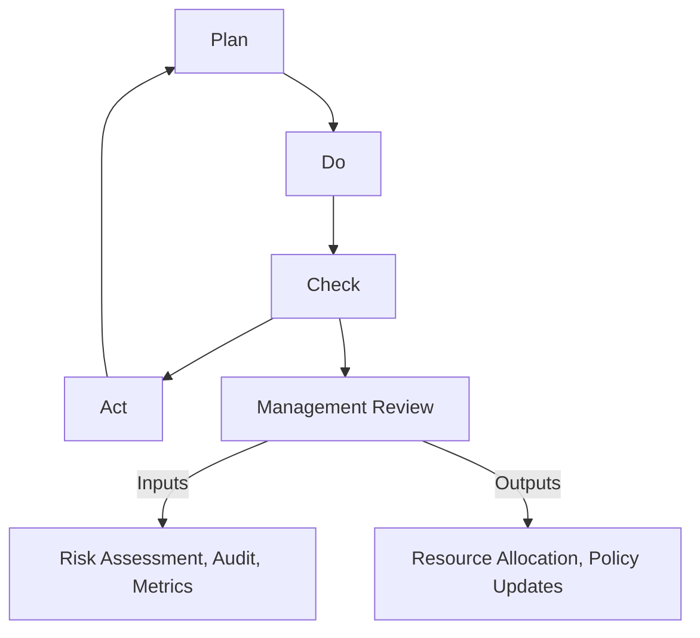

## Purpose of Management Review in ISO 27001  

The management review is a cornerstone of ISO 27001, serving as a strategic mechanism to evaluate the effectiveness of the Information Security Management System (ISMS) and ensure its alignment with organizational objectives. This process, mandated by ISO 27001:2022, enables top management to assess whether the ISMS is achieving its intended outcomes, identify gaps, and make informed decisions to drive continuous improvement. It is a critical component of the Plan-Do-Check-Act (PDCA) cycle, specifically embedded in the "Check" phase, where performance and progress are evaluated against defined criteria.  

### Strategic Alignment and Effectiveness Evaluation  
Management reviews ensure the ISMS remains aligned with the organization’s risk appetite, strategic goals, and regulatory requirements. This includes:  
- **Strategic Alignment**: Verifying that the ISMS supports business objectives and risk management priorities.  
- **Effectiveness Evaluation**: Assessing whether controls are functioning as intended and whether risks are adequately mitigated.  
- **Resource Optimization**: Determining if resources (budget, personnel, tools) are appropriately allocated to sustain or enhance the ISMS.  

### Continuous Improvement and Compliance  
The review process fosters a culture of continuous improvement by:  
- **Identifying Opportunities**: Highlighting areas for innovation, automation, or process refinement.  
- **Ensuring Compliance**: Confirming adherence to ISO 27001 requirements, legal obligations, and industry standards (e.g., GDPR, SOC 2).  
- **Stakeholder Engagement**: Incorporating feedback from internal and external stakeholders to refine the ISMS.  

---

## Inputs and Outputs of Management Review  

### Inputs  
- Risk assessment results and treatment plans  
- Internal audit findings and corrective actions  
- Incident reports and non-conformance records  
- Performance metrics (e.g., incident rates, compliance ratios)  
- Stakeholder feedback and business unit input  

### Outputs  
- Decisions on resource allocation, policy updates, or control enhancements  
- Action plans for addressing gaps or inefficiencies  
- Revised objectives for the ISMS and risk management framework  
- Updated documentation (e.g., risk register, ISMS policy)  

---

## Example: Management Review Agenda  

```markdown
## Management Review Meeting Agenda  
1. **Opening Remarks** (10 mins)  
2. **Review of Risk Assessment and Treatment** (30 mins)  
3. **Internal Audit Findings and Corrective Actions** (20 mins)  
4. **Incident and Non-Conformance Reports** (15 mins)  
5. **Performance Metrics and KPIs** (15 mins)  
6. **Stakeholder Feedback and Business Alignment** (20 mins)  
7. **Discussion and Strategic Decisions** (30 mins)  
8. **Action Plans and Next Steps** (15 mins)  
```

---

## Diagram: Management Review in the PDCA Cycle  



---

## Key takeaways  
- **Management review ensures ISMS alignment with organizational goals and risk appetite.**  
- **It evaluates effectiveness, identifies gaps, and drives continuous improvement.**  
- **Inputs include risk assessments, audits, and stakeholder feedback; outputs guide resource allocation and policy updates.**  
- **The process is strategic, requiring top management involvement to prioritize long-term ISMS sustainability.**
