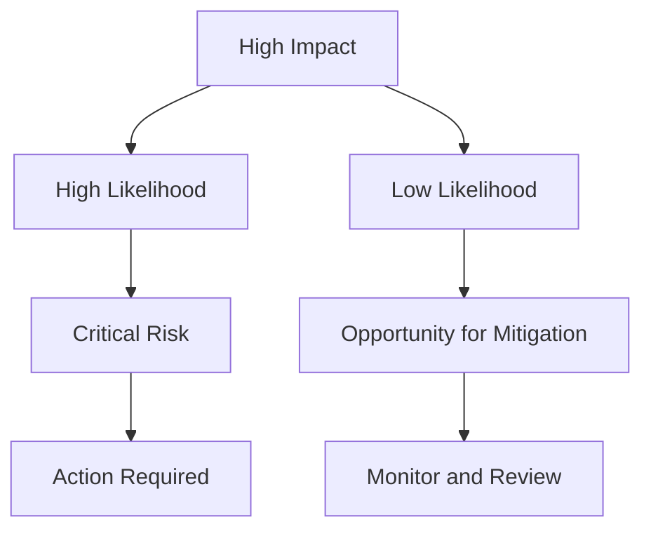
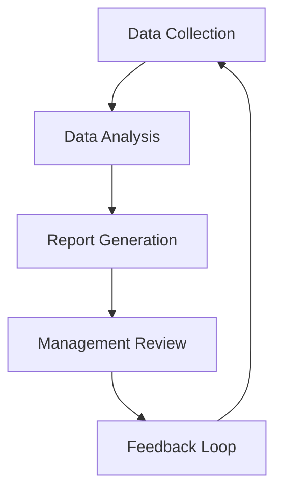

## Preparing for Management Review Meetings  

Management review meetings are a cornerstone of ISO 27001 compliance, providing leadership with insights into the effectiveness of the Information Security Management System (ISMS). To ensure productive discussions, preparation must focus on compiling structured data, actionable metrics, and risk reports that align with ISO 27001 clauses (e.g., Clause 9.3 on management review). This section outlines how to gather and present critical information for review.  

---

### Key Data to Compile  

Management reviews require a mix of qualitative and quantitative data to assess the ISMS’s performance. Prioritize the following:  

1. **Risk Assessment Results**  
   - Highlight residual risks, risk owners, and mitigation progress.  
   - Example: Use a risk register to show high-impact risks and their status.  

2. **Incident Reports**  
   - Aggregate data on incident frequency, resolution times, and root causes.  
   - Example: Use SQL to query a database:  
     ```sql
     SELECT COUNT(*) AS total_incidents, AVG(resolution_time) AS avg_resolution_time  
     FROM incidents  
     WHERE incident_date BETWEEN '2023-01-01' AND '2023-12-31';
     ```  

3. **Audit Findings**  
   - Summarize non-conformities, corrective actions, and closure status.  

4. **Compliance Status**  
   - Track adherence to standards (e.g., GDPR, PCI DSS) and regulatory requirements.  

5. **Resource Allocation**  
   - Provide insights into budget, personnel, and tool investments for ISMS improvements.  

---

### Metrics and KPIs for Review  

Quantify performance using metrics that align with ISO 27001 objectives:  

- **Incident Resolution Time**: Measure average time to resolve critical incidents.  
- **Compliance Rate**: Track percentage of policies and controls in place.  
- **Risk Mitigation Progress**: Percentage of high-risk items addressed.  
- **Training Participation Rate**: Percentage of staff completing security training.  

**Example**: Use Python to generate a compliance dashboard:  
```python
import pandas as pd  
compliance_data = pd.read_csv('compliance.csv')  
compliance_rate = compliance_data['compliant'].mean()  
print(f"Compliance Rate: {compliance_rate:.2%}")
```  

---

### Risk Reports for Review  

Structure risk reports to emphasize strategic priorities:  

1. **Risk Prioritization Matrix**  
   - Rank risks by impact and likelihood (e.g., a 5x5 grid).  

2. **Mitigation Plan Summary**  
   - Outline actions, owners, and timelines for high-priority risks.  

3. **Scenario Analysis**  
   - Model potential impacts of unresolved risks (e.g., financial loss, reputational damage).  

**Example**: Use a Mermaid diagram to visualize risk prioritization:  


---

### Tools and Techniques for Analysis  

Leverage tools to automate data collection and reporting:  

- **SIEM Tools**: Use Splunk or ELK Stack to aggregate logs and generate incident trends.  
- **Dashboarding**: Build dashboards in Tableau or Power BI for real-time metrics.  
- **Scripting**: Automate report generation with Python or shell scripts.  

**Example**: A shell script to export incident data:  
```bash
#!/bin/bash  
mysql -u user -p password -e "SELECT * FROM incidents" > incidents_report.csv
```  

---

### Diagram: Management Review Preparation Workflow  



---

## Key takeaways  
- **Align with ISO 27001**: Ensure all data and metrics reflect the standard’s requirements.  
- **Prioritize transparency**: Present risks and compliance gaps clearly to leadership.  
- **Leverage automation**: Use tools and scripts to streamline report creation and analysis.  
- **Focus on strategic impact**: Highlight how ISMS improvements align with organizational goals.  
- **Iterate continuously**: Treat management reviews as opportunities to refine the ISMS.
