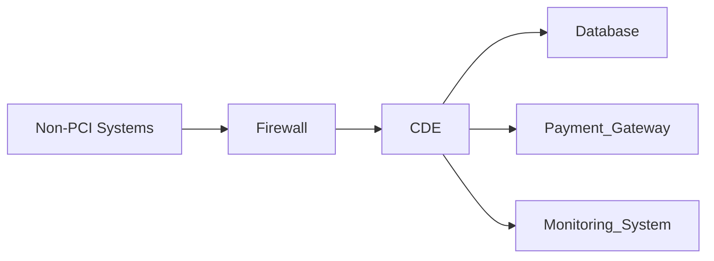
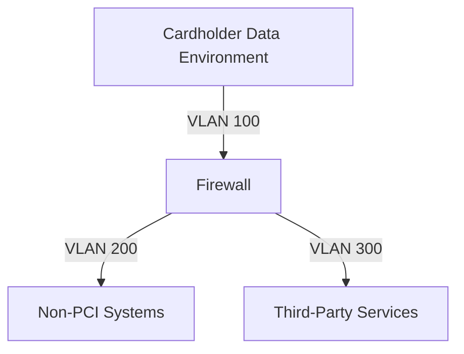

## Segmentation for CDE Protection  

In PCI DSS 4.0, network segmentation is a foundational control for isolating the Cardholder Data Environment (CDE) and reducing the attack surface. By physically or logically separating systems that process, store, or transmit cardholder data from general business networks, organizations can limit lateral movement during breaches, enforce least-privilege access, and simplify compliance audits. This section outlines how segmentation strategies align with PCI DSS 4.0 requirements and enhance CDE security.  

---

### Core Principles of CDE Segmentation  

1. **Isolation of CDE**:  
   The CDE must be entirely separated from non-PCI systems, including internal networks, public internet, and third-party services. This prevents unauthorized access and limits the scope of potential breaches.  
   - *Example*: Use firewalls or VLANs to create a dedicated subnet for CDE systems.  

2. **Access Control**:  
   Segmentation enforces strict access policies, ensuring only authorized personnel or systems can interact with CDE resources.  
   - *PCI DSS Requirement*: Requirement 1.1 mandates that CDE systems be isolated from non-PCI systems.  

3. **Containment of Threats**:  
   If a breach occurs, segmentation restricts the attacker’s ability to move laterally across the network, reducing the risk of data exfiltration.  

---

### Implementation Strategies  

#### 1. **Physical vs. Logical Segmentation**  
   - **Physical**: Use dedicated hardware (e.g., firewalls, switches) to isolate CDE.  
     ```bash
     # Example: Configure a firewall rule to restrict traffic between CDE and non-PCI subnets  
     iptables -A FORWARD -s 192.168.1.0/24 -d 192.168.10.0/24 -j DROP
     ```  
   - **Logical**: Employ VLANs or virtualization to segment traffic without physical separation.  

#### 2. **Zero Trust Architecture**  
   Implement micro-segmentation to enforce granular access controls between CDE components (e.g., payment gateways, databases).  
   - *Example*: Use software-defined networking (SDN) to dynamically isolate CDE endpoints.  

#### 3. **Monitoring and Logging**  
   Ensure segmentation policies are continuously monitored with intrusion detection systems (IDS) and centralized logging.  
   ```bash
   # Example: Check VLAN configuration on a Cisco switch  
   show vlan brief | grep "CDE_VLAN"
   ```  

---

### Compliance Considerations  

- **PCI DSS 4.0 Requirements**:  
  - **Requirement 1.1**: CDE must be isolated from non-PCI systems.  
  - **Requirement 1.2**: Access to CDE must be restricted to authorized systems and personnel.  
  - **Requirement 1.3**: Segmentation must be documented and tested annually.  

- **Third-Party Access**:  
  Ensure third-party systems (e.g., payment processors) are also segmented to prevent indirect exposure of CDE.  

- **Documentation**:  
  Maintain detailed diagrams of the segmented network, including firewalls, VLANs, and access controls.  

---

### Diagrams  





---

## Key takeaways  
- **Segmentation isolates CDE** from non-PCI systems, reducing breach risks and compliance scope.  
- **Firewalls, VLANs, and access controls** are critical for enforcing segmentation policies.  
- **PCI DSS 4.0 requires annual testing** and documentation of segmentation configurations.  
- **Zero Trust and micro-segmentation** enhance security by limiting lateral movement within the CDE.  
- **Third-party systems** must also be segmented to prevent indirect exposure of cardholder data.
