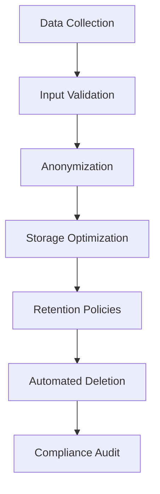

## Implementing Data Minimization  

Data minimization is a core principle of GDPR, requiring organizations to collect and retain only the data strictly necessary for their intended purpose. To achieve this, technical strategies must be embedded into data lifecycle management, from collection to deletion. Below are actionable techniques to implement data minimization effectively.  

---

### 1. **Data Collection Practices**  
Limit data collection to what is strictly necessary by:  
- **Input validation**: Use constraints (e.g., regex patterns) to restrict user input to required formats.  
- **Anonymization**: Strip non-essential identifiers (e.g., remove middle names from personal data).  
- **Purpose limitation**: Ensure data is collected only for specific, explicit purposes.  

**Example**:  
```bash
# Validate user input with regex to ensure only required fields are captured  
if ! [[ "$USER_INPUT" =~ ^[A-Za-z0-9]{8,}$ ]]; then  
  echo "Invalid input: must be 8+ alphanumeric characters"  
  exit 1  
fi  
```  

**Tools**:  
- **Apache NiFi**: Automate data flow validation.  
- **GDPR-compliant forms**: Use tools like Formstack or Typeform with built-in data minimization rules.  

---

### 2. **Retention Policies**  
Automate data deletion after the shortest necessary retention period.  
- **Lifecycle policies**: Configure cloud storage (e.g., AWS S3, Azure Blob Storage) to delete data after a defined timeframe.  
- **Scheduled scripts**: Use cron jobs or task schedulers to purge outdated data.  

**Example**:  
```bash
# Delete logs older than 90 days (dry-run mode enabled)  
find /var/log -type f -name "*.log" -mtime +90 -exec echo "Would delete: {}" \;  
# Remove actual files with -exec rm {} \;  
```  

**Tools**:  
- **Cloud storage lifecycle policies**: AWS S3, Google Cloud Storage.  
- **Retention automation**: Tools like **Retention Policies** in Microsoft 365.  

---

### 3. **Data Processing Techniques**  
Reduce data volume during processing:  
- **Differential privacy**: Add noise to datasets to anonymize individual records (complex, often requires third-party tools like **Google’s Differential Privacy Library**).  
- **Data masking**: Replace sensitive fields (e.g., credit card numbers) with placeholders in development environments.  

**Example**:  
```python
# Mask credit card numbers in a dataset  
import pandas as pd  
df['card_number'] = df['card_number'].str.replace(r'\d', 'X', regex=True)  
```  

**Tools**:  
- **Talend**: Data masking and anonymization workflows.  
- **Masking tools**: **Delphix** or **IBM InfoSphere**.  

---

### 4. **Data Storage Optimization**  
Minimize storage footprint while ensuring compliance:  
- **Compression**: Use tools like **gzip** or **zstd** to reduce storage size.  
- **Encryption**: Encrypt data at rest (e.g., AES-256) and in transit (e.g., TLS 1.3).  
- **Deduplication**: Eliminate redundant data copies using tools like **Veritas NetBackup**.  

**Example**:  
```bash
# Compress and encrypt logs before archiving  
gzip -c /var/log/app.log | openssl enc -aes-256-cbc -out /archive/app.log.enc  
```  

**Standards**:  
- **ISO 27001**: Guidelines for secure data handling.  
- **NIST CSF**: Framework for risk management and data retention.  

---

### 5. **Monitoring and Audit**  
Track data access and retention to ensure compliance:  
- **Logging**: Use tools like **Splunk** or **ELK Stack** to monitor data access patterns.  
- **Regular audits**: Validate retention policies and deletion triggers.  

**Example**:  
```sql
-- Anonymize user data in a database  
UPDATE users  
SET name = 'X' || substring(name, 2)  
WHERE created_at < '2022-01-01';  
```  

**Tools**:  
- **SIEM systems**: **Splunk**, **IBM QRadar**.  
- **Audit frameworks**: **SOC 2 Type 2** for data retention validation.  

---

## Diagrams  

### Data Minimization Workflow  


### Data Retention Lifecycle  
```mermaid  
graph LR  
    A[Data Created] --> B[Retain for Purpose]  
    B --> C[Automated Deletion Trigger]  
    C --> D[Data Deleted]  
    C --> E[Archive (if required)]  
```  

---

## Key takeaways  
- **Assess data needs**: Collect only what is strictly necessary for the purpose.  
- **Automate deletion**: Use lifecycle policies and scripts to enforce retention limits.  
- **Anonymize and mask**: Reduce data utility while preserving compliance.  
- **Optimize storage**: Combine compression, encryption, and deduplication to minimize data volume.  
- **Monitor and audit**: Continuously validate data handling practices against GDPR and standards like SOC 2.
