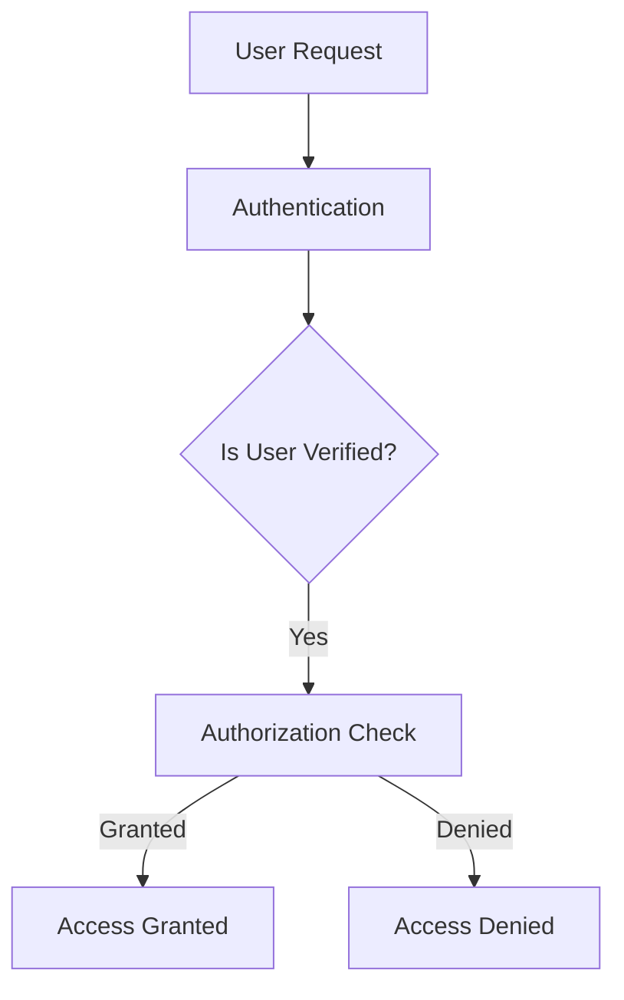
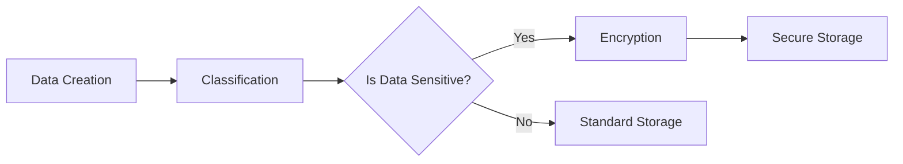
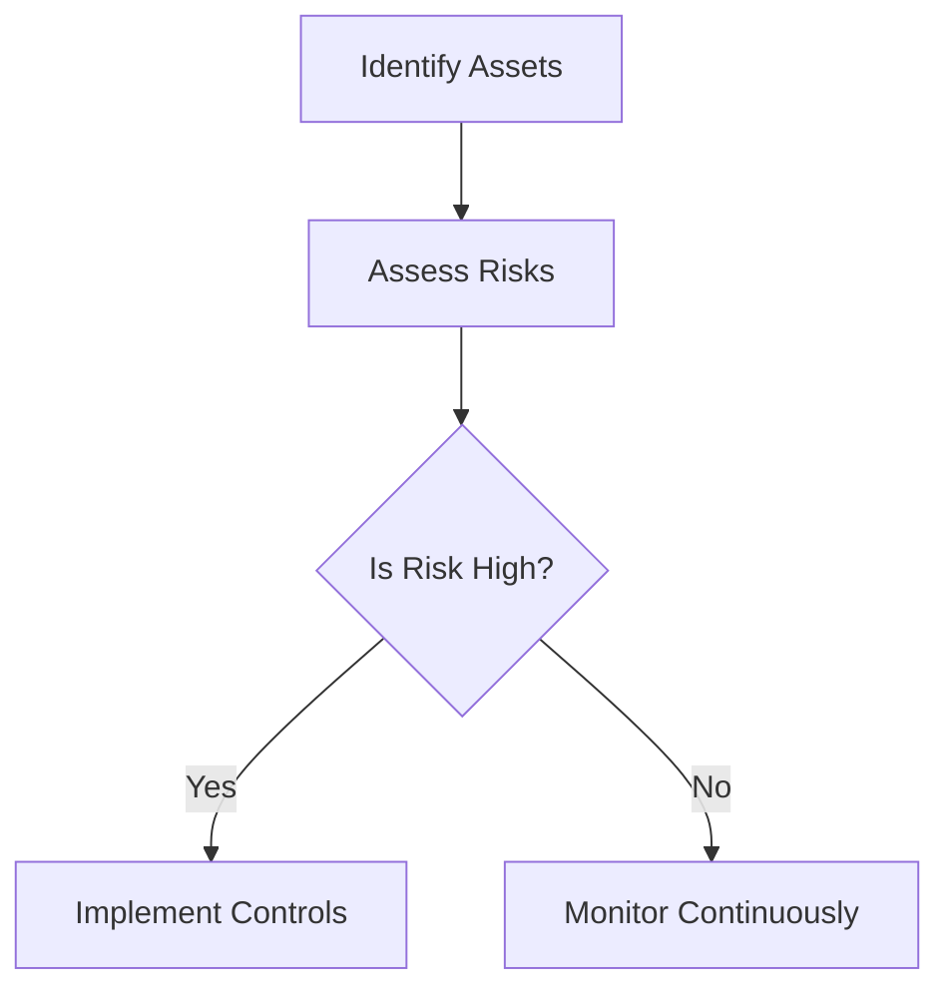
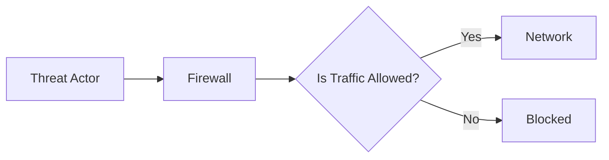

The **Protect function** of the NIST Cybersecurity Framework (CSF) 2.0 is a foundational pillar designed to safeguard systems, data, and assets from cyber threats. Its primary purpose is to implement safeguards that ensure the **confidentiality, integrity, and availability** (CIA triad) of organizational resources. By integrating access control, data protection, risk management, and protective measures, the Protect function mitigates risks and reduces the likelihood of security incidents. This section details its core components and implementation strategies.

---

## Core Components of the Protect Function

### 1. Access Control  
Access control ensures that only authorized users and systems can access sensitive resources. It involves **authentication**, **authorization**, and **least privilege principles**.  

**Implementation Strategies:**  
- **Multi-Factor Authentication (MFA):** Enforce MFA for all user accounts to reduce credential compromise risks.  
- **Role-Based Access Control (RBAC):** Assign permissions based on user roles to minimize unnecessary access.  
- **Regular Access Reviews:** Periodically audit and revoke unused or excessive privileges.  

**Example:**  
```bash
# Enable MFA for Azure Active Directory users (Azure CLI)
az ad user update --id <user-id> --mfa-enabled true
```

**Diagram:**  


---

### 2. Data Protection  
Data protection focuses on securing data at rest, in transit, and in use. It includes encryption, classification, and secure storage practices.  

**Implementation Strategies:**  
- **Encryption:** Use AES-256 for data at rest and TLS 1.2+ for data in transit.  
- **Data Classification:** Label data by sensitivity (e.g., public, confidential, restricted) to enforce handling rules.  
- **Data Loss Prevention (DLP):** Deploy tools to monitor and block unauthorized data transfers.  

**Example:**  
```bash
# Encrypt a database using OpenSSL (CLI)
openssl enc -aes-256-cbc -in sensitive_data.db -out encrypted_data.db -k <password>
```

**Diagram:**  


---

### 3. Risk Management  
Risk management within the Protect function involves identifying vulnerabilities, assessing risks, and applying mitigations.  

**Implementation Strategies:**  
- **Vulnerability Scanning:** Use tools like Nessus or OpenVAS to detect unpatched systems.  
- **Patch Management:** Prioritize critical patches for known vulnerabilities.  
- **Threat Modeling:** Identify potential attack vectors and design defenses accordingly.  

**Example:**  
```bash
# Scan for vulnerabilities using OpenVAS (CLI)
openvas --scanner <scanner-id> --target <target-ip>
```

**Diagram:**  


---

### 4. Protective Measures  
Protective measures include technical, administrative, and physical safeguards to prevent unauthorized access or disruptions.  

**Implementation Strategies:**  
- **Network Segmentation:** Isolate critical systems using firewalls and VLANs.  
- **Security Awareness Training:** Educate employees on phishing, social engineering, and safe practices.  
- **Physical Security:** Secure data centers with biometric access controls and surveillance.  

**Example:**  
```bash
# Configure a firewall rule to block unauthorized traffic (iptables)
iptables -A INPUT -s 192.168.1.100 -j DROP
```

**Diagram:**  


---

## Key takeaways  
- The **Protect function** ensures the CIA triad through access control, data protection, risk management, and protective measures.  
- **Access control** and **data protection** are critical for minimizing exposure to breaches.  
- **Automated tools** (e.g., vulnerability scanners, encryption utilities) enhance efficiency and compliance.  
- **Continuous monitoring** and **regular audits** are essential to adapt to evolving threats.  
- Integration with the **Identify** and **Respond** functions ensures a cohesive cybersecurity strategy.
