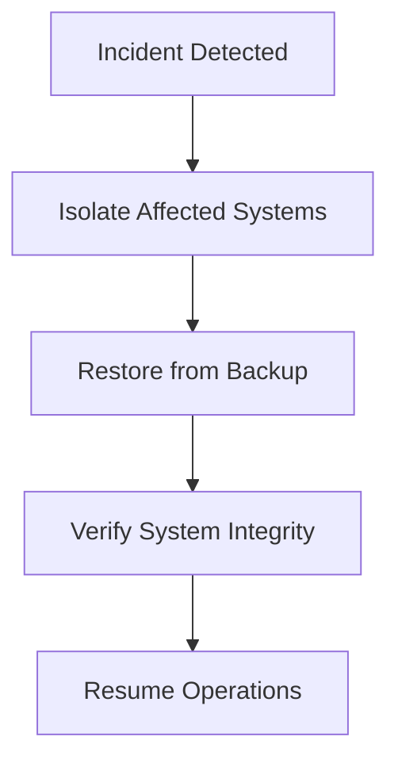

The **Recover function** in the NIST Cybersecurity Framework 1.1 (CSF 1.1) is a critical component of an organization’s cybersecurity strategy, focusing on restoring operations and systems after a cybersecurity incident. Its purpose is to ensure resilience, minimize downtime, and safeguard data integrity while aligning with business continuity goals. This section defines the core components of the Recover function, including system restoration and business continuity planning, and provides actionable guidance for implementation.

---

## Purpose of the Recover Function  
The Recover function aims to:  
1. **Restore systems and data** to their pre-incident state or a known good state.  
2. **Ensure business continuity** by maintaining operational resilience during and after disruptions.  
3. **Support incident recovery** through predefined processes, tools, and documentation.  
4. **Integrate with other functions** (e.g., Respond, Identify) to enable a cohesive cybersecurity lifecycle.  

**Example**: After a ransomware attack, the Recover function enables an organization to restore encrypted data from backups, isolate affected systems, and resume critical operations.  

---

## Core Components of the Recover Function  
### 1. System Restoration  
This involves restoring hardware, software, data, and configurations to a functional state. Key activities include:  
- **Data Backup and Recovery**: Regularly backing up critical systems and testing restoration processes.  
- **System Hardening**: Reconfiguring systems to eliminate vulnerabilities post-incident.  
- **Disaster Recovery (DR) Testing**: Validating recovery plans through simulations.  

**Example Command**:  
```bash
# Restore a database from a backup file  
pg_restore -d dbname /path/to/backup.dump  
```

**Diagram**:  


### 2. Business Continuity Planning  
This ensures that critical business functions remain operational during disruptions. Key elements include:  
- **Contingency Planning**: Defining alternative processes for disrupted operations.  
- **Resource Allocation**: Ensuring access to critical resources (e.g., backup infrastructure, personnel).  
- **Communication Protocols**: Establishing clear channels for internal and external stakeholders.  

**Example Command**:  
```bash
# Trigger a failover to a secondary data center  
ansible-playbook failover.yml --extra-vars "primary_dc=dc1 secondary_dc=dc2"  
```  

**Diagram**:  


---

## Implementation Considerations  
1. **Integration with Other Functions**:  
   - Align recovery processes with the **Respond** function (e.g., incident response plans) and the **Identify** function (e.g., asset inventory).  
   - Use **NIST CSF 1.1’s "Recover" subcategories** (e.g., *Recovery Planning*, *System Restoration*, *Improvements*) to structure efforts.  

2. **Continuous Improvement**:  
   - Regularly update recovery plans based on lessons learned from incidents or audits.  
   - Incorporate feedback from **ISO 27001 ISMS** or **SOC 2 Type 2** readiness assessments.  

3. **Compliance Alignment**:  
   - Ensure recovery processes meet requirements for **GDPR** (data subject rights), **PCI DSS v4.0** (payment data restoration), and **SOC 2** (availability and confidentiality).  

---

## Key takeaways  
- The **Recover function** prioritizes system restoration and business continuity to minimize downtime and data loss.  
- **System restoration** requires robust backups, testing, and post-incident hardening.  
- **Business continuity planning** ensures critical operations remain functional during disruptions.  
- Integration with other NIST CSF functions and compliance standards (e.g., GDPR, PCI DSS) strengthens recovery resilience.  
- Regular testing and updates are essential to maintain an effective recovery strategy.
