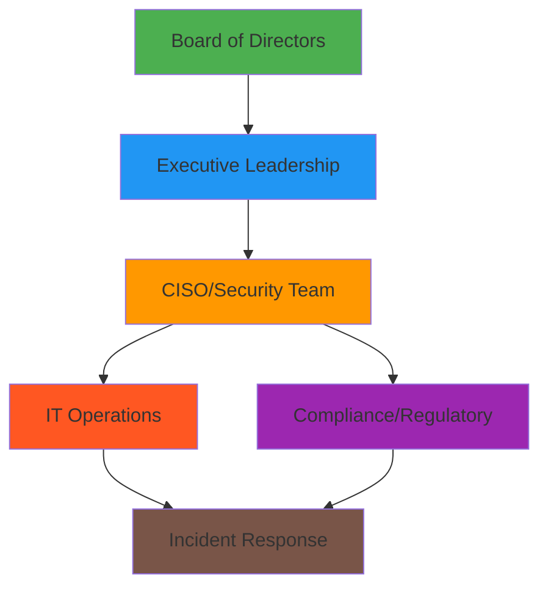
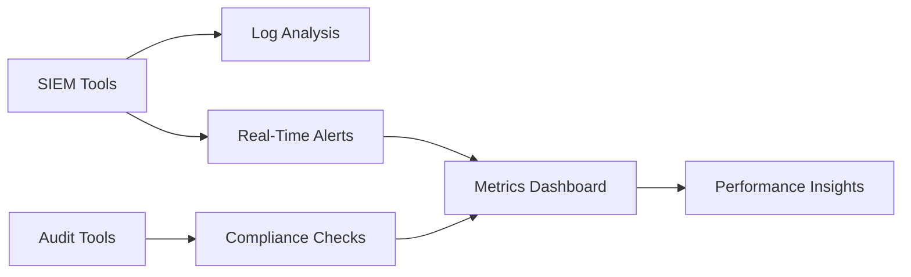

## Establishing Governance Structures, Performance Metrics, and Continuous Monitoring  

The **Govern** function in the NIST Cybersecurity Framework 2.0 (CSF 2.0) focuses on integrating cybersecurity into organizational governance, ensuring alignment with strategic objectives, and maintaining accountability for cybersecurity outcomes. Implementation requires structured governance frameworks, measurable performance metrics, and continuous monitoring processes. Below are the key steps to establish these elements.  

---

### 1. **Define Governance Structures**  
Establish a formal governance framework that aligns with organizational goals and regulatory requirements. This includes:  
- **Roles and Responsibilities**: Assign ownership for cybersecurity decisions (e.g., CISO, IT leadership, board-level oversight).  
- **Policies and Procedures**: Develop policies for incident response, access control, and compliance.  
- **Integration with Business Strategy**: Ensure cybersecurity goals are tied to organizational risk appetite and business objectives.  

**Example**:  
```bash
# Example: Automate policy compliance checks using Ansible  
ansible-playbook -i inventory.ini compliance_check.yml  
```  
This playbook could validate adherence to policies like access control or data encryption.  

**Diagram**:  

*Governance structure with cross-functional integration.*  

---

### 2. **Implement Performance Metrics**  
Quantify cybersecurity outcomes to measure effectiveness and identify gaps. Key metrics include:  
- **Risk Mitigation Progress**: Track the percentage of high-risk vulnerabilities addressed.  
- **Incident Response Time**: Measure time to detect and resolve incidents.  
- **Compliance Adherence**: Monitor adherence to regulatory standards (e.g., GDPR, SOC 2).  

**Example**:  
```python
# Example: Python script to calculate incident response time  
def calculate_response_time(detected_time, resolved_time):  
    return (resolved_time - detected_time).total_seconds() / 3600  
```  
This script could be integrated into dashboards for real-time monitoring.  

---

### 3. **Enable Continuous Monitoring**  
Deploy tools and processes to track cybersecurity posture and detect anomalies. Key activities:  
- **Automated Threat Detection**: Use SIEM tools (e.g., Splunk, ELK Stack) to analyze logs.  
- **Regular Audits**: Conduct internal audits to validate compliance with frameworks like ISO 27001 or PCI DSS.  
- **Feedback Loops**: Use metrics to refine policies and adjust resource allocation.  

**Example**:  
```bash
# Example: Splunk query to detect anomalous login attempts  
| search "login attempt" status=401 | stats count by src_ip  
```  
This query identifies potential brute-force attacks.  

**Diagram**:  

*Continuous monitoring pipeline integrating tools and metrics.*  

---

## Key takeaways  
- **Governance structures** must align cybersecurity with business strategy and regulatory requirements.  
- **Performance metrics** provide actionable insights into risk mitigation and compliance.  
- **Continuous monitoring** ensures proactive threat detection and iterative improvement of security postures.  
- Integration with other NIST CSF functions (e.g., Protect, Detect) is critical for holistic cybersecurity maturity.
