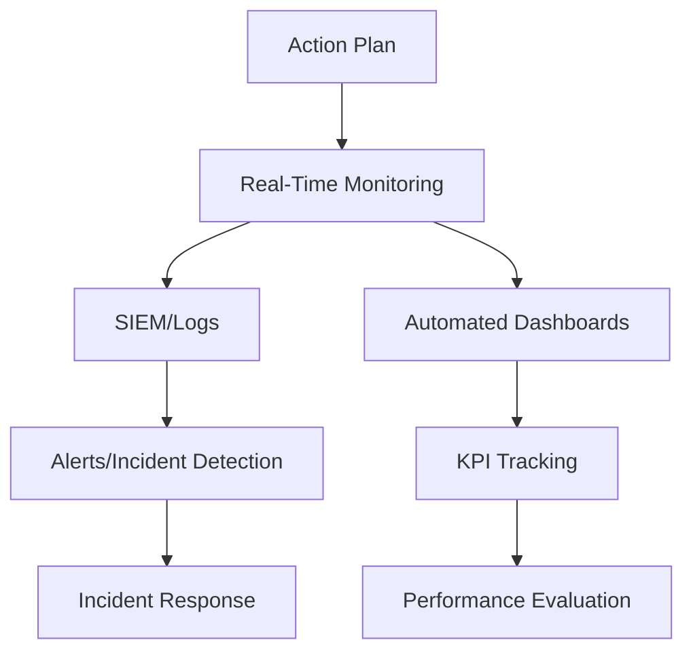
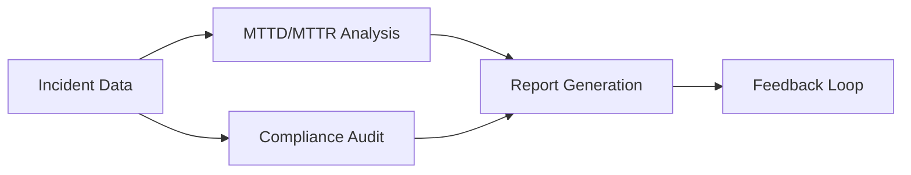
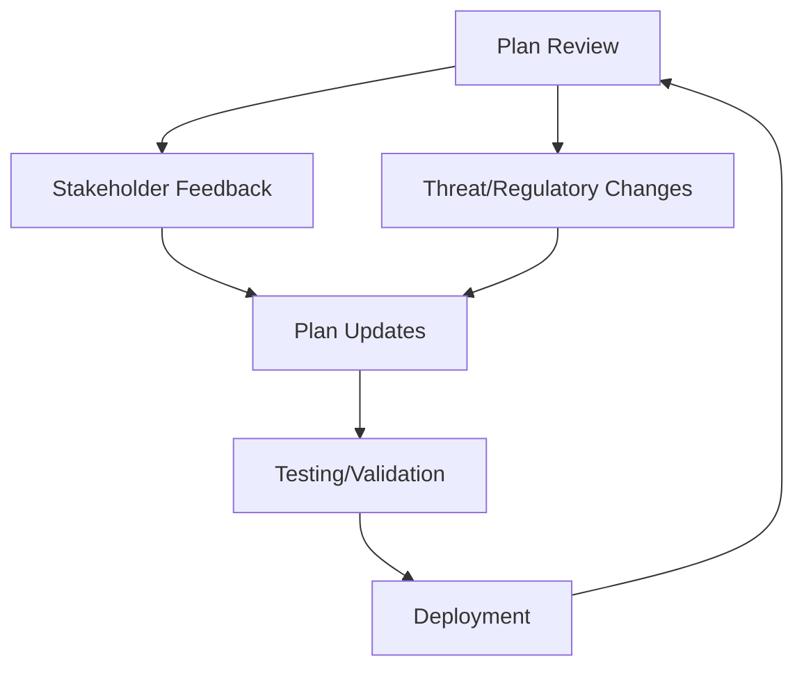

## Continuous Monitoring of Action Plans  

### **Tools and Processes for Ongoing Oversight**  
Effective monitoring of action plans requires integrating tools and processes that align with NIST CSF 2.0’s *Monitor* function. This includes:  
- **SIEM (Security Information and Event Management)** systems for real-time threat detection and log analysis.  
- **Automated dashboards** (e.g., using Grafana, Kibana, or Splunk) to track KPIs like incident response time, compliance rates, and risk exposure.  
- **Regular audits** (quarterly or semi-annual) to validate control effectiveness and identify gaps.  

**Example:**  
```bash
# Querying SIEM logs for high-severity incidents  
splunk search "severity=high OR severity=critical" | stats count by sourcetype  
```  

**Diagram:**  
*Figure 1: Continuous Monitoring Workflow*  


---

## Performance Evaluation and Metrics  

### **Quantifying Plan Effectiveness**  
Performance evaluation ensures action plans meet organizational goals. Key metrics include:  
- **Mean Time to Detect (MTTD)** and **Mean Time to Respond (MTTR)** for incidents.  
- **Compliance adherence rates** (e.g., GDPR data protection requirements).  
- **Risk reduction percentages** post-implementation of controls.  

**Example:**  
A quarterly review of incident response times:  
```excel
| Incident ID | MTTD (hours) | MTTR (hours) |  
|-------------|--------------|--------------|  
| INC-001     | 2.5          | 4.8          |  
| INC-002     | 1.2          | 3.1          |  
```  

**Diagram:**  
*Figure 2: Performance Evaluation Metrics*  


---

## Iterative Improvement and Plan Updates  

### **Adapting to Evolving Threats and Requirements**  
Action plans must evolve with new threats, regulatory changes (e.g., GDPR updates), or technological shifts. Steps include:  
1. **Stakeholder feedback** from security teams, compliance officers, and business units.  
2. **Version control** of plans using tools like Git or Confluence.  
3. **Scenario testing** (e.g., penetration testing, tabletop exercises) to validate updates.  

**Example:**  
Updating a plan after PCI DSS v4.0 adoption:  
```markdown  
## Revision 2.1: PCI DSS v4.0 Compliance  
- Added requirements for third-party vendor risk management.  
- Updated access control policies to align with v4.0 Section 9.2.  
```  

**Diagram:**  
*Figure 3: Iterative Improvement Cycle*  


---

## Key takeaways  
- **Continuous monitoring** via SIEM and dashboards ensures real-time visibility into plan effectiveness.  
- **Performance metrics** (e.g., MTTD, compliance rates) provide actionable insights for evaluation.  
- **Regular updates** driven by feedback, regulatory changes, and testing ensure plans remain relevant and effective.  
- **Version control** and documentation are critical for traceability and accountability.  
- **Cross-framework alignment** (e.g., NIST CSF 2.0 with ISO 27001) enhances holistic risk management.
