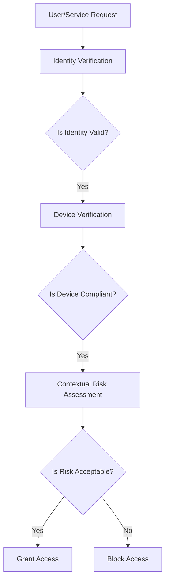

Zero Trust architecture fundamentally redefines security by abandoning the traditional "trust but verify" model in favor of **Never-Trust-Always-Verify** (NTAV). This principle mandates that no entity—whether internal or external—should be inherently trusted. Instead, every access request must be continuously validated against dynamic, context-aware policies. This shift addresses the vulnerabilities of perimeter-based security, which assumes trust within a defined network boundary. Zero Trust treats the network as untrusted by default, requiring strict verification for all users, devices, and services.

---

## Core Tenets of the NTAV Framework  
The NTAV framework operates on four pillars:  
1. **Identity Verification**: Confirm the user or service identity through strong authentication (e.g., OAuth2, OIDC, MFA).  
2. **Device Verification**: Ensure the requesting device meets security posture requirements (e.g., encryption, patch levels).  
3. **Continuous Monitoring**: Assess risk in real time based on contextual factors (e.g., location, behavior, device health).  
4. **Least-Privilege Access**: Grant access only to the resources explicitly needed, dynamically adjusted to risk levels.  

---

## Identity Verification: The First Line of Defense  
Identity verification is the cornerstone of Zero Trust. Modern systems rely on **OAuth2/OIDC** standards and **IAM platforms** like Keycloak to issue temporary tokens and enforce access controls.  

### Example: Keycloak Identity Verification  
```bash
# Create a client in Keycloak  
curl -X POST http://keycloak-server/auth/realms/demo/clients \
  -H "Authorization: Bearer <admin_token>" \
  -H "Content-Type: application/json" \
  -d '{"enabled": true, "clientId": "secure-app"}'

# Request an access token  
curl -X POST http://keycloak-server/auth/realms/demo/protocol/openid-connect/token \
  -H "Authorization: Bearer <admin_token>" \
  -d "grant_type=client_credentials&client_id=secure-app&client_secret=<client_secret>"
```

This flow ensures that only authenticated clients can access protected resources, aligning with the NTAV principle.

---

## Device Verification: Ensuring Trustworthy Hardware  
Devices must be validated to prevent compromised endpoints from accessing sensitive systems. Tools like **HashiCorp Vault** enforce device health checks and restrict access based on compliance status.  

### Example: Vault Device Policy Enforcement  
```bash
# Create a policy requiring device compliance  
vault write policies/device-compliance \
  policy='{
    "statements": [
      {"action": "read", "resource": "secrets/*", "condition": "device_compliant"}
    ]
  }'

# Store a secret with device-specific access  
vault kv put secret/data/protected \
  value="sensitive_data" \
  device_compliant=true
```

Here, access to secrets is conditional on the device meeting compliance criteria, ensuring only trusted hardware can retrieve them.

---

## Continuous Monitoring & Adaptive Policies  
Zero Trust requires **real-time risk assessment** using telemetry data. For example, an anomalous login from a new geographic location might trigger a temporary access denial or MFA challenge.  

### Example: Adaptive Policy in Action  
```bash
# Example rule in a SIEM tool (e.g., ELK Stack)  
if (user_location != "allowed_region" && login_time > "23:00") {
  alert("Potential unauthorized access");
  enforce_mfa();
}
```

This dynamic approach ensures policies evolve with emerging threats.

---

## Diagram: NTAV Verification Workflow  


---

## Key Takeaways  
- **Never trust any entity by default**: All access requests must be validated.  
- **Identity and device checks are mandatory**: Use IAM and posture assessment tools.  
- **Adapt to context**: Policies must evolve based on real-time risk signals.  
- **Minimize privileges**: Access is granted dynamically based on need-to-know principles.  
- **Automation is critical**: Continuous monitoring and enforcement reduce human error.
