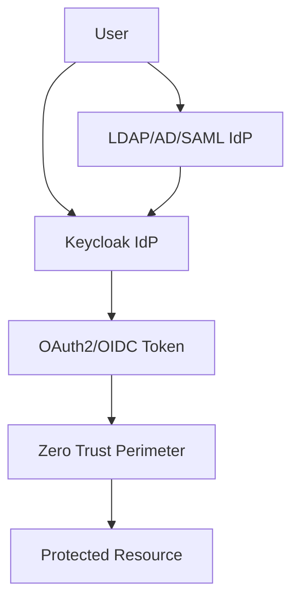

## Overview of Keycloak in Zero Trust Architecture  
Keycloak is a robust open-source Identity and Access Management (IAM) solution that aligns with Zero Trust principles by enforcing strict authentication, authorization, and identity verification. In a Zero Trust architecture, Keycloak acts as a central identity provider (IdP), managing user identities, federated access, and dynamic access policies. Its integration with Zero Trust frameworks enables secure, granular control over access to resources, ensuring "verify everything, trust nothing" is operationalized through OAuth2/OIDC protocols, multi-factor authentication (MFA), and attribute-based access control (ABAC).  

---

## Step-by-Step Keycloak Integration for Zero Trust IAM  

### 1. **Install and Configure Keycloak**  
Deploy Keycloak as a standalone service or within a containerized environment. For a production setup, use a secure, isolated network and configure TLS for all communication.  

**Example: Docker deployment**  
```bash
docker run -d \
  --name keycloak \
  -p 8080:8080 \
  -e KEYCLOAK_ADMIN=admin \
  -e KEYCLOAK_ADMIN_PASSWORD=securepassword \
  quay.io/keycloak/keycloak:latest
```  
Access the Keycloak Admin Console at `http://localhost:8080/auth` and create a new **Realm** (e.g., `zero-trust-realm`).  

---

### 2. **Create a Client Application**  
Register a client application to represent your Zero Trust-protected service.  

**Steps in Keycloak Admin Console:**  
1. Navigate to **Clients** > **Create Client**.  
2. Set the **Client ID** (e.g., `zero-trust-api`).  
3. Enable **Standard Flow** and **Implicit Flow**.  
4. Define **Redirect URIs** (e.g., `https://your-service.com/callback`).  
5. Set **Access Type** to `Confidential` and assign a **Client Secret**.  

**Example: Client Configuration JSON**  
```json
{
  "realm": "zero-trust-realm",
  "client_id": "zero-trust-api",
  "client_secret": "your-client-secret",
  "redirect_uris": ["https://your-service.com/callback"],
  "web_origins": ["https://your-service.com"]
}
```  

---

### 3. **Configure Identity Providers (IdPs)**  
If using federated identity (e.g., SAML, LDAP, or external OAuth2 providers), configure IdPs in Keycloak to enable seamless user authentication.  

**Example: Adding an LDAP IdP**  
1. In the Admin Console, go to **Identity Providers** > **Add Provider**.  
2. Select **LDAP** and configure connection details (host, port, bind DN, password).  
3. Map user attributes (e.g., `uid`, `email`) to Keycloak user properties.  

---

### 4. **Map User Attributes for Zero Trust Policies**  
Keycloak can emit user attributes (e.g., roles, groups, custom claims) that downstream systems use to enforce Zero Trust policies.  

**Example: Custom Attribute Mapping**  
1. In the Admin Console, go to **Users** > select a user > **Attributes**.  
2. Add custom attributes like `department`, `riskScore`, or `location`.  
3. Configure **Client Scopes** to expose these attributes to your application.  

**Example: Client Scope Configuration**  
```bash
curl -X POST \
  http://localhost:8080/auth/realms/zero-trust-realm/clients/{client-id}/client-scopes \
  -H "Authorization: Bearer your-admin-token" \
  -H "Content-Type: application/json" \
  -d '{
    "name": "zero-trust-attributes",
    "protocolMappers": [
      {
        "name": "department",
        "protocol": "openid-claims",
        "protocolMapper": "oidc-user-attribute",
        "config": {
          "user.attribute": "department",
          "claim.name": "department",
          "jsonType": "string"
        }
      }
    ]
  }'
```  

---

### 5. **Integrate with Zero Trust Perimeter**  
Use Keycloak's OAuth2/OIDC endpoints to authenticate users and validate tokens against the Zero Trust perimeter.  

**Example: OAuth2 Token Introspection**  
```bash
curl -X POST \
  http://localhost:8080/auth/realms/zero-trust-realm/protocol/openid-connect/token/introspect \
  -H "Authorization: Bearer your-access-token" \
  -d "token=your-access-token"
```  
Validate the response for claims like `groups`, `roles`, and custom attributes to enforce access control.  

---

## Architecture Diagram (Text Description)  

*This diagram illustrates Keycloak as the central identity provider, federating with external IdPs and validating tokens against Zero Trust policies.*  

---

## Key Takeaways  
- Keycloak centralizes identity management, aligning with Zero Trust's "verify everything" principle.  
- Configure clients, IdPs, and attribute mappings to enforce granular access control.  
- Use OAuth2/OIDC endpoints for secure token validation and dynamic policy enforcement.  
- Secure Keycloak deployments with TLS, strong secrets, and isolation from the Zero Trust perimeter.  
- Regularly audit and update Keycloak configurations to adapt to evolving Zero Trust requirements.
