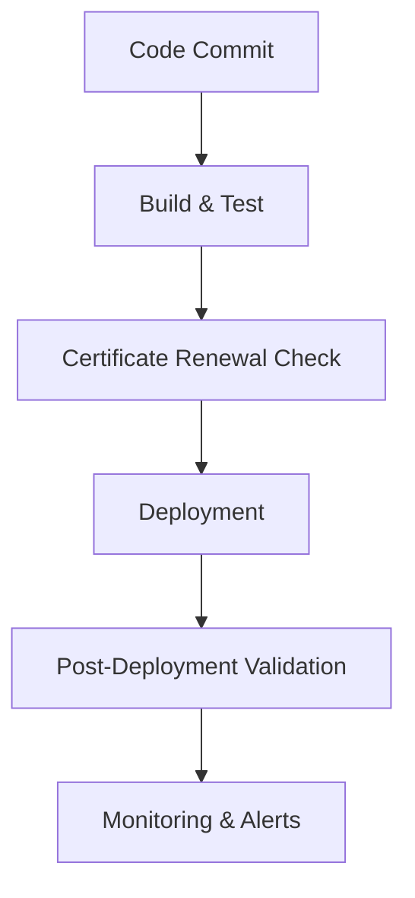

## Integrating Renewal with CI/CD Pipelines  

Automating certificate renewal within DevOps workflows ensures that cryptographic assets remain valid, compliant, and operational without manual intervention. By embedding certificate lifecycle management into CI/CD pipelines, teams can enforce strict renewal schedules, validate certificate metadata, and deploy updated certificates seamlessly across environments. This section outlines strategies for integrating certificate auto-renewal with CI/CD tools, emphasizing security, reliability, and auditability.  

---

### CI/CD Pipeline Integration Overview  

A typical CI/CD pipeline includes stages like code testing, infrastructure provisioning, and deployment. Certificate renewal should be integrated into the **deployment phase** or as a **pre-deployment check** to ensure certificates are valid before services go live.  

**Diagram**:  


Key steps include:  
1. **Triggering renewal**: Based on certificate expiration dates or scheduled intervals.  
2. **Validation**: Ensuring the renewed certificate meets compliance requirements (e.g., SANs, key lengths).  
3. **Deployment**: Updating service configurations (e.g., TLS endpoints, application secrets) with the new certificate.  
4. **Monitoring**: Confirming the certificate is active and operational post-deployment.  

---

### Tooling and Automation Frameworks  

#### 1. **Jenkins Pipeline**  
Use the `cert-manager` plugin or custom scripts to renew certificates. Example:  
```groovy
pipeline {
    agent any
    stages {
        stage('Renew Certificate') {
            steps {
                script {
                    sh 'openssl x509 -in /path/to/cert.pem -checkend 30'
                    sh 'cert-manager renew --cert /path/to/cert.pem'
                }
            }
        }
    }
}
```  

#### 2. **GitHub Actions**  
Leverage scheduled workflows to renew certificates. Example:  
```yaml
name: Renew Certificates
on:
  schedule:
    - cron: '0 0 1 * *'  # Monthly renewal

jobs:
  renew:
    runs-on: ubuntu-latest
    steps:
      - name: Renew Certificate
        run: |
          openssl x509 -in cert.pem -checkend 30
          cert-manager renew --cert cert.pem
```  

#### 3. **GitLab CI/CD**  
Integrate with a certificate management tool like `cfssl` or `vault` for secure renewal. Example:  
```yaml
renew_certificate:
  script:
    - openssl x509 -in cert.pem -checkend 30
    - vault write pki/issue/mydomain csr=@csr.pem
  only:
    - schedules
```  

---

### Automating Certificate Renewal Workflows  

#### 1. **Generating and Submitting Renewal Requests**  
Use tools like `openssl` or `cfssl` to generate a Certificate Signing Request (CSR) and submit it to your internal CA. Example:  
```bash
openssl req -new -key private.key -out csr.pem
# Submit CSR to CA via API or CLI
```  

#### 2. **Replacing Old Certificates**  
Automate the replacement of old certificates in service configurations. Example:  
```bash
# Replace certificate in Nginx config
sed -i 's/ssl_certificate \/path\/to\/old.pem/ssl_certificate \/path\/to\/new.pem/' /etc/nginx/nginx.conf
systemctl reload nginx
```  

#### 3. **Secrets Management Integration**  
Store private keys and renewed certificates in HashiCorp Vault or Keycloak. Example:  
```bash
# Write private key to Vault
vault kv put secret/cert private_key=@private.key
# Retrieve during deployment
vault kv get secret/cert
```  

---

### Integration with PKI and Secrets Management  

- **HashiCorp Vault**: Use the `vault pki/sign` command to sign renewal requests and store certificates securely.  
- **Keycloak**: Automate certificate renewal via the Keycloak REST API to update service accounts or client credentials.  
- **OAuth2/OIDC**: Ensure renewed certificates are valid for OpenID Connect tokens by validating the `x5u` header in ID tokens.  

---

### Monitoring and Compliance Checks  

- **Audit Logs**: Track renewal events in CI/CD logs and PKI audit trails.  
- **Health Checks**: Use tools like `curl` or `openssl s_client` to verify certificate validity post-deployment.  
- **Alerting**: Configure alerts for renewal failures or expired certificates using Prometheus and Grafana.  

---

## Key takeaways  
- Automate certificate renewal within CI/CD pipelines to ensure continuous uptime and compliance.  
- Integrate with PKI systems and secrets management tools to securely handle private keys and certificate lifecycles.  
- Implement monitoring and alerts to detect and resolve renewal failures promptly.  
- Use infrastructure-as-code practices to manage certificate configurations and dependencies across environments.
