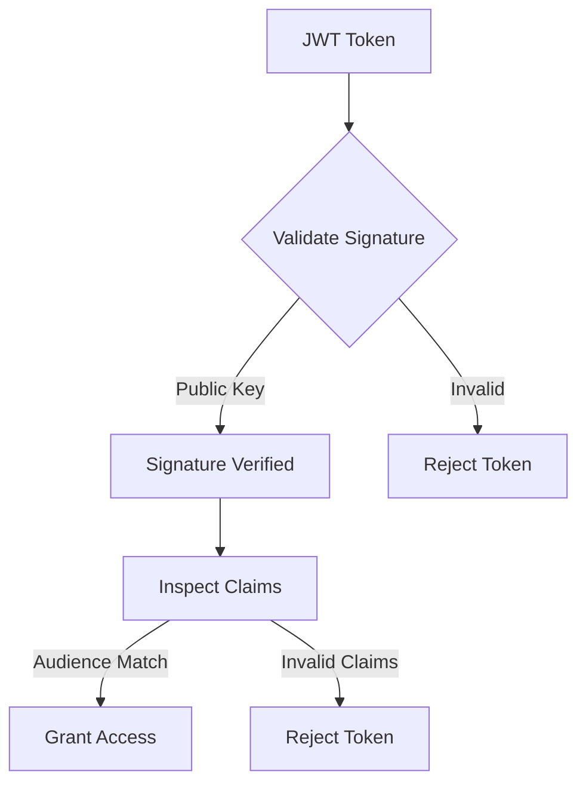

## Tools for JWT Debugging and Analysis  

JWT tokens are central to OAuth2 and OpenID Connect flows, but their complexity demands robust tools for inspection, validation, and troubleshooting. This section explores key tools and techniques to analyze JWTs, including online utilities, identity provider consoles, and cryptographic tools.  

---

### jwt.io: Online JWT Inspector  
**Description**: A browser-based tool for decoding, validating, and inspecting JWTs. It supports standard JWT formats and can verify signatures using public keys.  
**Use Cases**:  
- Quick inspection of token claims.  
- Debugging malformed tokens.  
- Verifying signature algorithms (e.g., RS256, HS256).  

**Example**:  
Paste a JWT into the `JWT` field on [https://jwt.io/](https://jwt.io/). The tool automatically splits the token into header, payload, and signature. Use the "Verify Signature" button to validate against a public key (if available).  

**CLI Alternative**:  
Use `jq` to decode a JWT:  
```bash
echo "your.jwt.token" | jq -R 'split(".") | .[0] + "." + .[1] + "." + .[2]' | jq -R 'split(".") | .[0] | @base64d'  # Header  
echo "your.jwt.token" | jq -R 'split(".") | .[0] + "." + .[1] + "." + .[2]' | jq -R 'split(".") | .[1] | @base64d'  # Payload  
```  

---

### Keycloak Admin Console: Integrated Token Analysis  
**Description**: Keycloak’s built-in console allows inspecting tokens issued by the identity provider. It provides detailed claims and signature validation.  
**Use Cases**:  
- Debugging token issuance issues.  
- Verifying audience (`aud`) and issuer (`iss`) claims.  
- Checking token expiration and scopes.  

**Example**:  
1. Log in to Keycloak Admin Console.  
2. Navigate to **Realm Settings** > **Tokens** > **Validate Token**.  
3. Paste the JWT and click "Validate" to check claims and signature.  

**CLI Alternative**:  
Use `curl` to fetch a token and inspect it:  
```bash
curl -X POST "http://keycloak-server/auth/realms/your-realm/protocol/openid-connect/token" \
  -d "client_id=your-client" \
  -d "client_secret=your-secret" \
  -d "grant_type=client_credentials" \
  | jq -r '.access_token'
```  
Then paste the token into jwt.io or the Keycloak console.  

---

### HashiCorp Vault: Secret Management and Token Validation  
**Description**: Vault can validate JWTs as part of its authentication workflows, ensuring tokens are signed by trusted issuers.  
**Use Cases**:  
- Validating tokens against pre-configured public keys.  
- Integrating with OAuth2 providers for dynamic secret management.  

**Example**:  
Use the `vault token decode` command to inspect a token:  
```bash
vault token decode <token>
```  
This reveals metadata like `iss`, `exp`, and `sub`, as well as the token’s signature.  

---

### OpenSSL: Signature Verification  
**Description**: OpenSSL can verify JWT signatures using public keys, useful for debugging cryptographic mismatches.  
**Use Cases**:  
- Confirming signature algorithms (e.g., RS256).  
- Validating tokens against known public keys.  

**Example**:  
Verify a JWT signature with a public key:  
```bash
openssl dgst -sha256 -verify public_key.pem -signature signature.bin <token>
```  
Replace `public_key.pem` with the issuer’s public key and `signature.bin` with the token’s signature (extracted from the token’s base64 URL-encoded signature part).  

---

### CLI Tools: jwt-cli and jwtdump  
**Description**: Lightweight command-line utilities for decoding and analyzing JWTs.  
**Use Cases**:  
- Automating token validation in scripts.  
- Extracting claims for logging or auditing.  

**Example**:  
Decode a JWT with `jwt-cli`:  
```bash
jwt-cli decode your.jwt.token
```  
Or use `jwtdump` to extract claims:  
```bash
jwtdump your.jwt.token
```  

---

### Debugging in Keycloak and Vault  
**Keycloak**:  
- Enable debug logging in `standalone.xml` or `standalone-ha.xml` to trace token validation errors.  
- Check the `token_introspection` endpoint for detailed error messages.  

**Vault**:  
- Configure `token_policies` to enforce strict JWT validation rules.  
- Use the `vault token revoke` command to invalidate problematic tokens.  

---

### Diagram: JWT Validation Workflow  


---

## Key takeaways  
- **jwt.io** is ideal for quick, visual inspection of JWTs.  
- **Keycloak Admin Console** provides deep integration for debugging issued tokens.  
- **HashiCorp Vault** enables secure validation of JWTs in secret management workflows.  
- **OpenSSL** and CLI tools like `jwt-cli` are essential for cryptographic analysis and automation.  
- Always validate tokens against trusted public keys to prevent signature mismatches.
