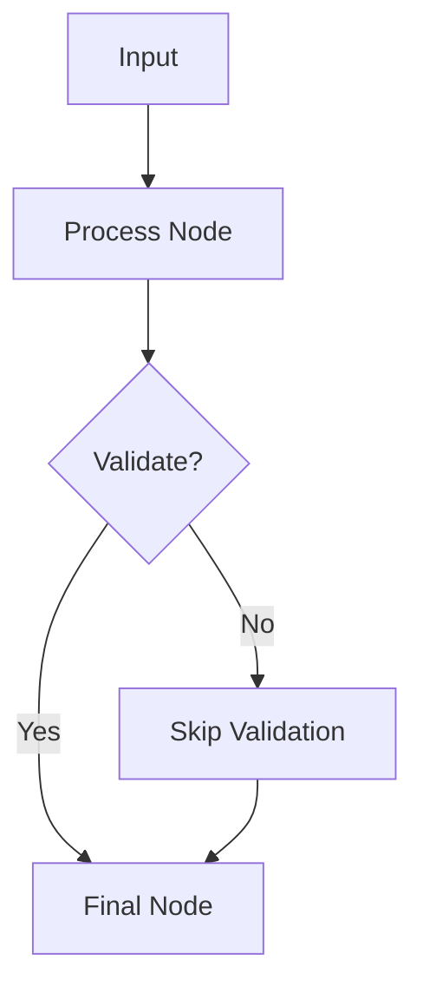

LangGraph enables the construction of agentic workflows by organizing tasks into **nodes**, defining data flow via **edges**, and structuring complex logic through **graph architectures**. These components work together to model decision-making, data transformation, and dynamic execution paths in AI systems. Below, we break down the core concepts and demonstrate their implementation.

---

## Nodes: Task Representation and Execution

Nodes are the fundamental units of a LangGraph, representing individual tasks or functions. Each node encapsulates a specific operation, such as data processing, model inference, or conditional checks. Nodes can be synchronous or asynchronous, and they expose input/output interfaces for data exchange.

### Example: Defining a Node
```python
from langgraph.graph import Node

def process_data(input: dict) -> dict:
    """Example node that transforms input data."""
    return {"processed": input["raw"]}

process_node = Node("process_data", process_data)
```

Nodes can also be **stateful**, retaining internal state between invocations. For example, a node might track historical data for anomaly detection.

---

## Edges: Data Flow and Control Logic

Edges define how data moves between nodes. They specify the **input** of a node and the **output** of a preceding node. Edges can also encode **conditional logic**, allowing workflows to branch based on input values.

### Example: Connecting Nodes with Edges
```python
from langgraph.graph import Edge

# Define edges to connect nodes
edge1 = Edge("process_node.output", "next_node.input")
edge2 = Edge("process_node.output", "conditional_node.input")

# Conditional edge: route based on a value
conditional_edge = Edge(
    "conditional_node.output",
    "final_node.input",
    condition=lambda data: data["flag"] == "true"
)
```

Edges can be **directed** (unidirectional) or **bidirectional** (for feedback loops), enabling complex interactions like iterative refinement or validation.

---

## Graph Structures: Orchestrating Complex Workflows

Graph structures organize nodes and edges into a cohesive workflow. LangGraph supports various topologies, including:

1. **Linear**: Sequential execution (e.g., data ingestion → processing → storage).
2. **Branching**: Conditional routing (e.g., "if X, do A; else, do B").
3. **Cyclic**: Loops for iterative tasks (e.g., retraining models until convergence).
4. **Parallel**: Concurrent execution of independent nodes (e.g., parallel data validation).

### Example: Building a Branching Graph
```python
from langgraph.graph import Graph

workflow = Graph()
workflow.add_node("process_node", process_data)
workflow.add_node("validate_node", validate_data)
workflow.add_node("final_node", finalize_output)

# Define edges
workflow.add_edge("process_node", "validate_node")
workflow.add_edge("validate_node", "final_node")
workflow.add_edge("process_node", "final_node", condition=lambda data: data["skip_validation"])
```

Graphs can be **serialized** for deployment, enabling integration with MLOps tools like MLflow or Kubeflow for versioning and monitoring.

---

## Diagrams: Visualizing Workflow Logic

Here’s a Mermaid.js diagram illustrating a branching workflow:


This visualization clarifies how data flows through nodes and how conditions influence the path.

---

## Key Takeaways
- **Nodes** represent individual tasks, encapsulating logic and state.
- **Edges** define data flow and control logic, enabling conditional routing.
- **Graph structures** orchestrate complex workflows, supporting linear, branching, cyclic, and parallel execution.
- These components enable flexible, modular, and scalable agentic workflows for AI systems.
