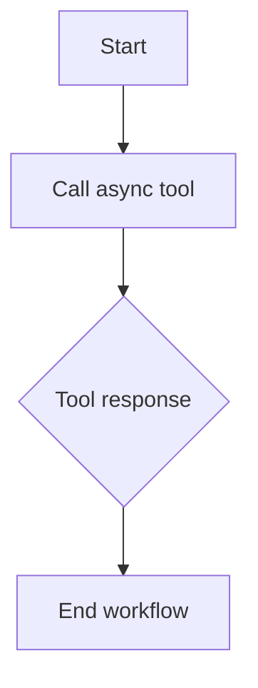

# Calling External Tools and APIs  

Integrating LangGraph with external tools and APIs enables agents to perform complex tasks by leveraging external systems. This section covers patterns for invoking tools, handling asynchronous operations, and ensuring robustness in real-world workflows.  

---

## Tool Calling Patterns in LangGraph  

LangGraph supports structured tool calling via the `tool_call` and `tool_response` nodes. These nodes allow agents to interact with external APIs, databases, or services while maintaining control flow and state.  

### Example: Invoking a REST API  
```python
from langgraph import tool
import httpx

@tool
async def fetch_weather(city: str) -> str:
    async with httpx.AsyncClient() as client:
        response = await client.get(f"https://api.weather.com/data/{city}")
        return response.text

# Usage in a graph
from langgraph.graph import StateGraph, END

class State:
    city: str

graph = StateGraph(State)
graph.add_node("call_weather_tool", fetch_weather)
graph.add_edge("call_weather_tool", END)
```

### Asynchronous Execution  
For I/O-bound operations (e.g., HTTP requests), use `async/await` to avoid blocking the event loop. LangGraph integrates with `async` workflows via `async def` nodes.  

---

## Asynchronous Tool Execution  

Handling asynchronous tools requires careful coordination to prevent deadlocks and ensure responsiveness. Use `asyncio`-compatible libraries like `aiohttp` or `httpx` for non-blocking API calls.  

### Example: Async API Integration  
```python
import asyncio
from langgraph.graph import START, END, StateGraph

class State:
    query: str

async def search_web(query: str) -> str:
    # Simulate async web search
    await asyncio.sleep(1)
    return f"Results for '{query}'"

graph = StateGraph(State)
graph.add_node("search", search_web)
graph.add_edge(START, "search")
graph.add_edge("search", END)
```

### Diagram: Async Tool Flow  


---

## Integrating with External APIs  

When connecting to external APIs, define clear input/output schemas and handle authentication, rate limits, and error codes. Use middleware like `httpx` for retries and timeouts.  

### Example: Authenticated API Call  
```python
from langgraph.graph import tool
import httpx

@tool
async def query_db(endpoint: str, token: str) -> dict:
    async with httpx.AsyncClient() as client:
        response = await client.get(
            endpoint,
            headers={"Authorization": f"Bearer {token}"}
        )
        return response.json()
```

---

## Error Handling and Retries  

Robust workflows must handle failures gracefully. Use retries with backoff, logging, and fallback strategies.  

### Example: Retry on Failure  
```python
from tenacity import retry, stop_after_attempt, wait_exponential
import httpx

@retry(stop=stop_after_attempt(3), wait=wait_exponential(multiplier=1, max=10))
async def reliable_api_call(endpoint: str) -> dict:
    async with http,client as client:
        response = await client.get(endpoint)
        response.raise_for_status()
    return response.json()
```

---

## Key takeaways  
- Use `tool_call` and `tool_response` nodes for structured API interactions.  
- Leverage `async/await` for non-blocking I/O operations in LangGraph.  
- Integrate with REST APIs using `httpx` or `aiohttp` for async requests.  
- Implement retries and error handling with libraries like `tenacity`.  
- Prioritize robustness by validating responses and managing edge cases.
