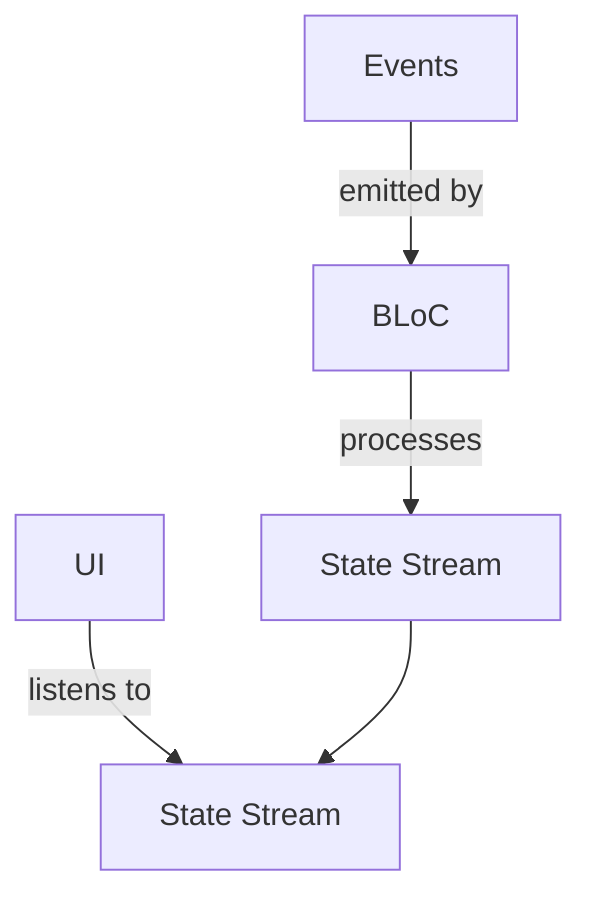

Flutter apps often require robust state management to handle complex interactions and maintain a clean architecture. The **BLoC (Business Logic Component)** pattern is a widely adopted approach that separates state management from the UI, enabling scalable, testable, and maintainable code. By decoupling business logic from the user interface, BLoC allows developers to focus on handling events, transforming data, and updating the state without tightly coupling it to the UI layer.

---

## Core Principles of BLoC Architecture  
The BLoC pattern is built on three core principles:  
1. **Separation of Concerns**: Business logic, state, and UI are kept in distinct layers.  
2. **Event-Driven Flow**: Changes to the state are triggered by events, which are processed by the BLoC.  
3. **Unidirectional Data Flow**: Data flows in a single direction (event → BLoC → state → UI), ensuring predictability and easier debugging.  

This architecture ensures that the UI remains passive, only reacting to state changes, while the BLoC handles all logic and data transformations.

---

## Key Components of the BLoC Pattern  
The BLoC pattern consists of four primary components:  

### 1. **Events**  
Events are triggers that represent user actions or external changes (e.g., button clicks, API responses). They are emitted as `Stream<Event>`.  
```dart
abstract class CounterEvent {}
class IncrementEvent extends CounterEvent {}
```

### 2. **BLoC (Business Logic Component)**  
The BLoC class processes events and updates the state. It uses `StreamController` to manage the state stream.  
```dart
class CounterBloc {
  final _counter = BehaviorSubject<int>(initialValue: 0);
  Stream<int> get counter => _counter.stream;

  void increment() {
    _counter.add(_counter.value + 1);
  }
}
```

### 3. **State**  
The state represents the current UI context and is emitted as a `Stream<State>`. It is typically a simple class or enum.  
```dart
class CounterState {
  final int count;
  CounterState(this.count);
}
```

### 4. **UI (StreamBuilder)**  
The UI listens to the state stream using `StreamBuilder` to rebuild when the state changes.  
```dart
StreamBuilder<int>(
  stream: bloc.counter,
  builder: (context, snapshot) {
    return Text('Count: ${snapshot.data}');
  },
)
```

---

## Benefits of Using BLoC  
- **Testability**: Business logic is isolated, making unit tests for logic and state transitions straightforward.  
- **Scalability**: Modular BLoC classes can be reused across features or screens.  
- **Maintainability**: Separating concerns reduces coupling, making the codebase easier to maintain.  
- **Predictability**: Unidirectional data flow minimizes side effects and debugging complexity.  

---

## Example: A Simple Counter App  
Here’s a minimal BLoC implementation for a counter app:  

**Event:**  
```dart
abstract class CounterEvent {}
class IncrementEvent extends CounterEvent {}
```

**BLoC:**  
```dart
class CounterBloc {
  final _counter = BehaviorSubject<int>(initialValue: 0);
  Stream<int> get counter => _counter.stream;

  void increment() {
    _counter.add(_counter.value + 1);
  }
}
```

**UI:**  
```dart
class CounterScreen extends StatelessWidget {
  final CounterBloc bloc = CounterBloc();

  @override
  Widget build(BuildContext context) {
    return Column(
      children: [
        StreamBuilder<int>(
          stream: bloc.counter,
          builder: (context, snapshot) {
            return Text('Count: ${snapshot.data}');
          },
        ),
        ElevatedButton(
          onPressed: bloc.increment,
          child: Text('Increment'),
        ),
      ],
    );
  }
}
```

---

## Diagram: BLoC Architecture Flow  


---

## Key takeaways  
- BLoC separates state management from the UI, promoting clean architecture.  
- Events drive state changes, ensuring predictable and testable logic.  
- The unidirectional data flow simplifies debugging and scalability.  
- BLoC is ideal for complex apps requiring modular, reusable state logic.  
- Always use `StreamBuilder` to react to state changes in the UI.
