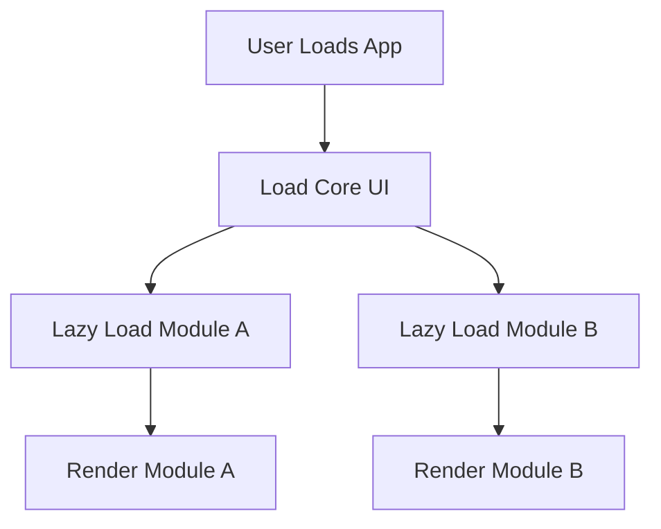

## Performance Considerations in Federated Micro Frontends

Micro frontends introduce unique performance challenges due to distributed loading, shared dependencies, and the need for seamless user experiences. Optimizing federated modules requires strategies that balance lazy loading, caching, and efficient resource management to minimize latency and maximize rendering speed.

---

## Lazy Loading Strategies

Lazy loading is critical for reducing initial load times by deferring non-critical module loading until needed. In federated architectures, this is often achieved through dynamic imports and route-based loading.

### Dynamic Imports with Webpack/Vite
Use dynamic `import()` to load federated modules on demand. For example:
```js
// React example using Webpack
const loadModule = async () => {
  const { default: Module } = await import('https://example.com/federated-module');
  return Module;
};
```
This approach ensures modules are only fetched when their corresponding routes or components are accessed.

### Route-Based Lazy Loading
Split modules by route to load only the necessary code for active navigation. For instance, in a React app:
```js
// App.jsx
const Home = lazy(() => import('./modules/home'));
const About = lazy(() => import('./modules/about'));

const App = () => (
  <Routes>
    <Route path="/" element={<Home />} />
    <Route path="/about" element={<About />} />
  </Routes>
);
```
This reduces the initial bundle size and improves time-to-interactive.

### Bundle Splitting
Use tools like Webpack’s `SplitChunks` or Vite’s plugin system to split federated modules into smaller chunks. For example:
```js
// Webpack config
optimization: {
  splitChunks: {
    chunks: 'all',
    minSize: 20000,
    maxInitialRequests: 5,
  },
},
```
This ensures each module is as small as possible, reducing transfer overhead.

---

## Caching Strategies

Caching federated modules reduces redundant network requests and accelerates subsequent loads. Effective caching requires careful management of cache keys, invalidation, and storage.

### Browser Caching with HTTP Headers
Configure HTTP headers to enable browser caching for static assets:
```http
Cache-Control: public, max-age=31536000, immutable
ETag: "abc123"
```
Use `ETag` or `Last-Modified` headers to validate cached resources and avoid stale data.

### Service Worker Caching
Implement service workers to cache federated modules and enable offline access. Example:
```js
// sw.js
const cacheName = 'federated-cache-v1';
const cacheAssets = [
  '/federated-module.js',
  '/shared-library.js',
];

self.addEventListener('install', (event) => {
  event.waitUntil(
    caches.open(cacheName).then((cache) => cache.addAll(cacheAssets))
  );
});
```
Use `Cache API` to store and retrieve modules, and implement cache invalidation when new versions are deployed.

---

## Shared Dependency Optimization

Shared dependencies between micro frontends can cause bloating if not managed properly. Use these techniques to minimize overhead:

### Shared Chunking
Bundle shared libraries into a single chunk to avoid duplication. For Webpack:
```js
// webpack.config.js
new webpack.SharedModulePlugin({
  shared: {
    'lodash': {
      requiredVersion: '^4.17.21',
      singleton: true,
    },
  },
}),
```
This ensures shared libraries are loaded once and reused across modules.

### Versioning and Conflict Avoidance
Use semantic versioning for shared dependencies and enforce strict version ranges to prevent conflicts. For example:
```json
{
  "dependencies": {
    "shared-library": "^1.2.3"
  }
}
```
Tools like Yarn Workspaces or Lerna can help manage versioned shared packages.

---

## Diagrams

### Lazy Loading Strategy


### Caching Workflow


---

## Key takeaways
- **Prioritize lazy loading** to defer non-critical module loading and reduce initial bundle sizes.  
- **Implement caching strategies** (HTTP headers, service workers) to minimize redundant network requests.  
- **Optimize shared dependencies** via chunking, versioning, and strict dependency management to avoid bloat.  
- Use tools like Webpack’s `SplitChunks` or Vite’s dynamic imports to fine-tune performance.
