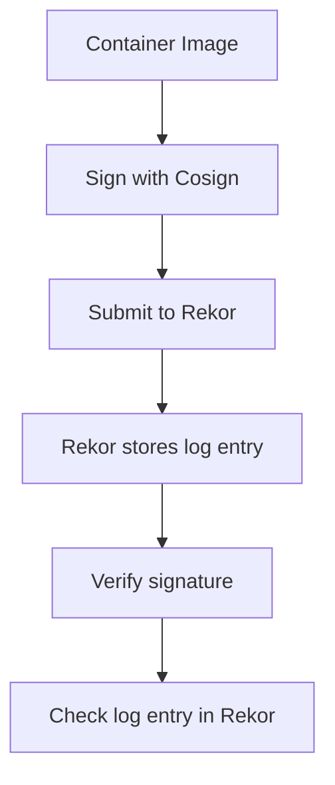

Container image signing with Cosign relies on Sigstore components like Rekor to ensure transparency and auditability. Rekor serves as a **transparency log** that records cryptographic logs of signatures, enabling immutable verification of container image integrity. By storing these logs, Rekor allows anyone to audit the signing process and confirm that an image has not been tampered with. This is critical for security in multi-cloud environments where trust in the supply chain is paramount.

---

## Role of Rekor in Transparency Logs  
Rekor is a **publicly accessible, immutable log** that records cryptographic artifacts (e.g., signatures, attestations) from Sigstore. Each log entry is stored in a Merkle tree structure, ensuring data integrity and enabling efficient verification. Key features include:  
- **Immutability**: Once a log entry is added, it cannot be altered or deleted.  
- **Auditability**: Anyone can query the log to verify the existence of a signature or attestation.  
- **Transparency**: The log is publicly accessible, ensuring visibility into the signing process.  

When a container image is signed with Cosign, the resulting signature is submitted to Rekor. This creates a verifiable record that can be used to validate the image’s authenticity during runtime.

---

## Integration with Cosign  
Cosign integrates with Rekor to automate the submission of signature logs. The process involves:  
1. **Signing the image**: Cosign generates a cryptographic signature and submits it to Rekor.  
2. **Storing the log entry**: Rekor assigns a unique hash to the log entry and appends it to the Merkle tree.  
3. **Verification**: During runtime, Cosign checks the log entry’s existence and integrity to confirm the image’s validity.  

### Example: Submitting a Signature to Rekor  
```bash
# Configure Rekor URL (default is https://rekor.sigstore.dev)
cosign config set log-url https://rekor.sigstore.dev

# Sign an image and submit to Rekor
cosign sign --output signature.json my-registry/my-image:tag
```

### Example: Verifying a Signature with Rekor  
```bash
# Verify the signature and check the log entry
cosign verify --log-url https://rekor.sigstore.dev my-registry/my-image:tag
```

---

## Verification Process  
To verify a container image using Rekor:  
1. **Retrieve the signature**: Cosign fetches the signature from the image’s metadata.  
2. **Query Rekor**: The log entry is checked against Rekor’s Merkle tree to confirm its existence.  
3. **Validate integrity**: The signature is verified against the image’s hash, ensuring it matches the log entry.  

This process ensures that the image has not been modified since signing and that the signature is valid.

---

## Diagram: Rekor Integration Flow  


---

## Key takeaways  
- Rekor ensures **immutability and auditability** of cryptographic logs for container images.  
- Cosign automates the submission of signatures to Rekor, enabling transparent verification.  
- The transparency log allows **third-party validation** of image integrity, critical for secure multi-cloud operations.  
- Always configure Rekor’s URL in Cosign to ensure logs are stored and verified correctly.
