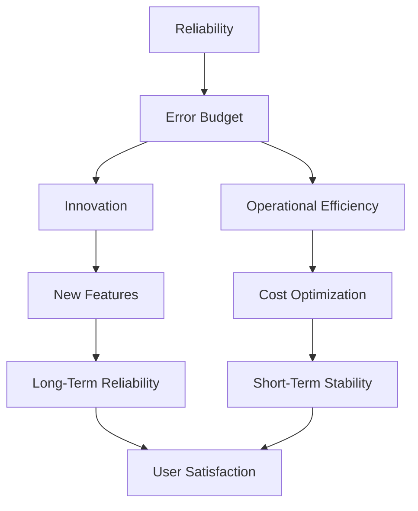

## Balancing Reliability with Innovation and Operational Efficiency  

Error budgets provide a structured framework to quantify reliability trade-offs, enabling teams to allocate capacity for innovation, operational efficiency, and maintaining service levels. By treating reliability as a finite resource, organizations can make intentional decisions about where to invest time, money, and effort. This section explores how error budgets help balance reliability against competing business goals.  

---

### ## Reliability vs. Innovation  

Innovation often requires allocating resources to new features, experiments, or architectural improvements. However, these efforts can temporarily reduce reliability if not managed carefully. Error budgets allow teams to explicitly trade off short-term reliability for long-term innovation.  

**Example:**  
A team might decide to use a portion of their error budget to fix a critical bug in a legacy system (improving reliability) or invest in a new feature that could increase user engagement (driving innovation). The error budget acts as a safety net, ensuring that reliability remains within acceptable bounds.  

**Command Example:**  
```bash
# Adjust error budget threshold for a service using Prometheus  
curl -X POST http://prometheus-api/alertmanager/api/v1/alerts \
  -H "Content-Type: application/json" \
  -d '{
    "alerts": [
      {
        "status": "pending",
        "labels": {
          "alertname": "error-budget-exhausted",
          "service": "user-service"
        },
        "annotations": {
          "summary": "Error budget for user-service is approaching its limit",
          "description": "Current error budget usage: 85% (threshold: 90%). Consider pausing non-critical innovations."
        }
      }
    ]
  }'
```  

**Key Considerations:**  
- **Risk vs. Reward:** Allocate error budget to high-impact innovations only if the potential ROI justifies the risk.  
- **Documentation:** Clearly document which innovations are funded by error budgets to avoid unintended reliability degradation.  

---

### ## Reliability vs. Operational Efficiency  

Operational efficiency (e.g., automation, scaling, or cost optimization) can sometimes introduce reliability risks. For example, aggressive auto-scaling might lead to transient errors during traffic spikes. Error budgets allow teams to tolerate these errors while maintaining service levels.  

**Example:**  
A team might optimize their infrastructure to reduce costs by scaling down idle resources. If this leads to occasional latency spikes, the error budget ensures that the system remains within its SLOs. If the budget is exhausted, the team must re-evaluate the trade-off.  

**Command Example:**  
```bash
# Monitor error budget usage with Prometheus and Grafana  
# Query to calculate error budget percentage used  
curl http://prometheus:9090/api/v1/query?query=100%20*%20(rate(http_requests_total%20%7Bjob%3D%22user-service%22%7D%20%7Bstatus%3D%225xx%22%7D)%20/%20(http_requests_total%20%7Bjob%3D%22user-service%22%7D%20%7Bstatus%3D%222xx%22%7D))
```  

**Key Considerations:**  
- **Dynamic Adjustments:** Use error budgets to dynamically adjust operational efficiency efforts. For example, pause cost-optimization initiatives if the budget is nearing its limit.  
- **Monitoring:** Integrate error budget metrics into dashboards (e.g., Grafana) to visualize trade-offs in real time.  

---

### ## Communication and Documentation  

Effective error budget management requires cross-functional collaboration. Teams must communicate how their actions impact the error budget and align on priorities. For example:  
- **Dev Teams:** Must document which innovations are funded by error budgets.  
- **Ops Teams:** Must ensure operational efficiency initiatives do not exceed the allocated budget.  

**Diagram Example:**  


---

## Key takeaways  
- **Error budgets quantify reliability trade-offs**, enabling intentional decisions about innovation and efficiency.  
- **Innovation** can temporarily reduce reliability but should be funded by allocated error budget capacity.  
- **Operational efficiency** must balance cost savings with reliability, using error budgets as a buffer for temporary errors.  
- **Communication and documentation** are critical to align teams on how error budgets are used across business goals.
