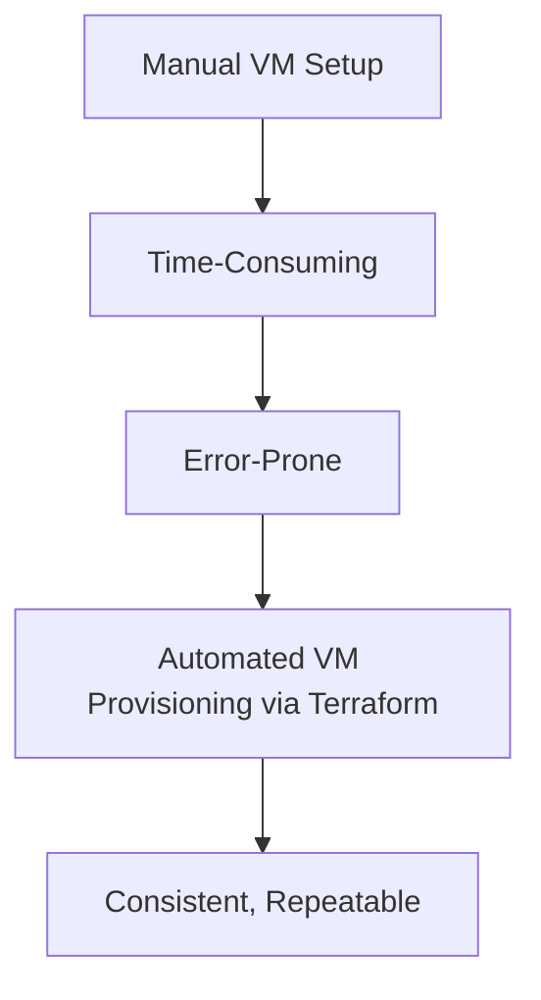
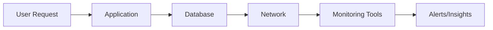

## Tools and Practices for Toil Reduction  

Toil reduction is central to achieving operational excellence in Site Reliability Engineering (SRE). By automating repetitive tasks, standardizing workflows, and leveraging observability tools, teams can minimize manual intervention, reduce error-prone processes, and focus on strategic initiatives. This section explores key tools and practices for reducing toil and improving operational efficiency.  

---

### ## Automation and Orchestration  
Automation is the cornerstone of toil reduction. By automating infrastructure provisioning, configuration management, and routine maintenance tasks, teams eliminate manual effort and ensure consistency.  

**Tools:**  
- **Infrastructure as Code (IaC):** Tools like Terraform, Ansible, and CloudFormation enable declarative infrastructure management.  
- **CI/CD Pipelines:** Platforms like Jenkins, GitLab CI, or GitHub Actions automate deployment and testing workflows.  
- **Orchestration:** Kubernetes (via Helm) or Docker Swarm automate container orchestration and scaling.  

**Example:**  
A Terraform script to provision a virtual machine:  
```hcl
resource "aws_instance" "example" {
  ami           = "ami-0c55b159cbfafe1f0"
  instance_type = "t2.micro"
}
```  
This script ensures consistent infrastructure deployment across environments, reducing manual configuration errors.  

**Command:**  
```bash
terraform apply --auto-approve
```  

**Diagram:**  


---

### ## Monitoring and Observability  
Proactive monitoring and observability tools reduce the need for reactive troubleshooting. By collecting metrics, logs, and traces, teams can identify issues before they impact users.  

**Tools:**  
- **Metrics:** Prometheus, Datadog, or New Relic for real-time performance tracking.  
- **Logs:** ELK Stack (Elasticsearch, Logstash, Kibana) or Fluentd for centralized log analysis.  
- **Tracing:** Jaeger, Zipkin, or OpenTelemetry for distributed system debugging.  

**Example:**  
A Prometheus query to detect high latency:  
```promql
avg_over_time(http_request_duration_seconds{job="my_app"}[5m]) > 0.5
```  
This query triggers alerts when average latency exceeds 500ms, enabling early intervention.  

**Command:**  
```bash
curl -G http://localhost:9090/api/v1/query --data 'query=avg_over_time(http_request_duration_seconds{job="my_app"}[5m])'
```  

**Diagram:**  


---

### ## Incident Management and Runbooks  
Standardized incident response processes reduce toil during outages. Runbooks and automation tools ensure teams follow consistent protocols.  

**Tools:**  
- **Incident Management:** PagerDuty, Opsgenie, or VictorOps for alert routing and escalation.  
- **Runbooks:** Documented procedures for common issues (e.g., "500 Internal Server Error").  

**Example:**  
A PagerDuty alert configuration:  
```json
{
  "service": "web-app",
  "escalation": [
    {"step": 1, "targets": ["@oncall-team"]},
    {"step": 2, "targets": ["@slo-team"]}
  ]
}
```  
This ensures timely escalation and reduces manual decision-making during incidents.  

---

### ## Standardization and Documentation  
Consistent processes and thorough documentation minimize the need for ad-hoc problem-solving.  

**Practices:**  
- **Infrastructure as Code (IaC):** Standardize environments using Terraform or Pulumi.  
- **Documentation:** Maintain centralized knowledge bases (e.g., Confluence, Notion) with runbooks and architecture diagrams.  
- **GitOps:** Use Git for version-controlled infrastructure and application configurations.  

**Command:**  
```bash
git clone https://github.com/myorg/infrastructure.git
cd infrastructure
terraform init
```  

**Diagram:**  
```mer
graph TD
    A[Git Repository] --> B[Infrastructure Code]
    B --> C[Automated Deployment]
    C --> D[Consistent Environments]
```  

---

### ## Postmortem Analysis and Learning  
Postmortems after incidents help identify systemic issues and prevent recurrence.  

**Key Elements:**  
- **Root Cause:** Identify the primary cause of the incident.  
- **Contributing Factors:** List secondary issues (e.g., misconfigurations, dependencies).  
- **Preventive Actions:** Document steps to avoid similar incidents.  

**Example Postmortem Template:**  
```markdown
## Incident: High Latency in Web Service  
**Root Cause:** Database query timeout due to unoptimized SQL.  
**Contributing Factors:**  
- Lack of monitoring for slow queries.  
- Manual scaling during peak traffic.  
**Preventive Actions:**  
- Implement Prometheus alerts for slow queries.  
- Automate horizontal scaling using Kubernetes HPA.  
```  

---

## Key takeaways  
- **Automate repetitive tasks** using IaC, CI/CD, and orchestration tools to reduce manual effort.  
- **Leverage observability** (metrics, logs, tracing) to proactively detect and resolve issues.  
- **Standardize processes** with runbooks, GitOps, and consistent documentation to minimize ad-hoc work.  
- **Conduct postmortems** to analyze incidents and implement systemic improvements.  
- **Integrate incident management tools** to ensure timely escalation and reduce response toil.
