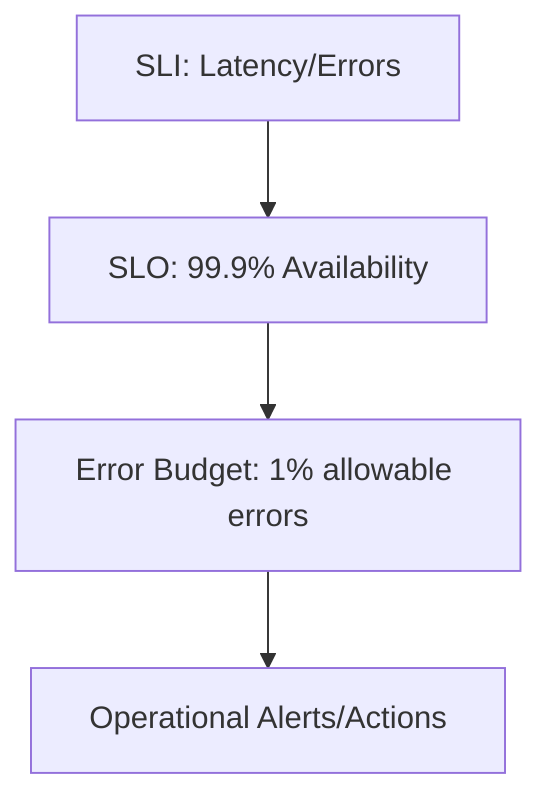

## Key Metrics for SRE Success

In Site Reliability Engineering (SRE), metrics are the foundation for measuring system reliability, performance, and operational health. These metrics inform decisions about service-level objectives (SLOs), error budgets, and incident response. The most critical metrics fall into three categories: **system reliability metrics**, **performance metrics**, and **operational health metrics**. Each plays a unique role in ensuring systems meet user expectations while balancing innovation and stability.

---

### ## System Reliability Metrics

#### 1. **Latency (SLI)**  
Latency measures the time it takes for a system to respond to a request. It is a core SLI for services where response time directly impacts user experience.  
- **Example**: For a web application, latency could be the time between an HTTP request and the first byte of the response.  
- **Tools**: Use Prometheus to track `http_request_duration_seconds` or `latency_seconds`.  
- **Command Example**:  
  ```promql
  avg_over_time(http_request_duration_seconds{job="my-service"}[5m])
  ```  
- **Visualization**: Grafana dashboards can display latency trends over time, with alerts for thresholds exceeding SLOs.

#### 2. **Error Rate (SLI)**  
The error rate quantifies the proportion of failed requests. It is critical for services where reliability is non-negotiable (e.g., financial systems).  
- **Formula**:  
  $$
  \text{Error Rate} = \frac{\text{Number of Failed Requests}}{\text{Total Requests}} \times 100
  $$  
- **Command Example**:  
  ```promql
  (sum(http_requests_total{status!~"2.."}) / sum(http_requests_total)) * 100
  ```  
- **SLO Alignment**: An SLO like "99.9% success rate" translates to an error rate threshold of 0.1%.

#### 3. **Availability (SLI)**  
Availability measures the percentage of time a service is operational. It is often tied to uptime guarantees (e.g., "99.95% availability").  
- **Formula**:  
  $$
  \text{Availability} = \frac{\text{Uptime}}{\text{Total Time}} \times 100
  $$  
- **Tools**: Use `up{job="my-service"}` in Prometheus to track uptime.  
- **Example**: A 99.95% availability SLO requires 4.38 hours of downtime per year.

---

### ## Performance Metrics

#### 1. **Throughput (SLI)**  
Throughput measures the number of requests a system can handle per unit time. It is critical for systems with high traffic demands.  
- **Example**: A microservice might have a throughput of 10,000 requests per second.  
- **Command Example**:  
  ```promql
  rate(http_requests_total{job="my-service"}[5m])
  ```  
- **SLO Alignment**: An SLO like "10,000 RPS" defines the baseline for scaling and capacity planning.

#### 2. **Resource Utilization**  
Metrics like CPU, memory, and disk usage help identify bottlenecks.  
- **Example**: A server with 90% CPU utilization may require scaling or optimization.  
- **Tools**: Prometheus metrics like `node_cpu_seconds_total` or `container_memory_usage_bytes`.

---

### ## Operational Health Metrics

#### 1. **Error Budget Utilization**  
This metric tracks how much of the allocated error budget has been consumed. It balances reliability and innovation.  
- **Formula**:  
  $$
  \text{Error Budget Utilization} = \frac{\text{Actual Errors}}{\text{Allowed Errors (SLO Threshold)}} \times 100
  $$  
- **Example**: If an SLO allows 1% errors (10,000 errors/year), a 5% utilization means 500 errors have occurred.  
- **Command Example**:  
  ```promql
  (sum(http_requests_total{status!~"2.."}) / (0.01 * sum(http_requests_total))) * 100
  ```  
- **Alerting**: Trigger alerts when utilization exceeds 80% to avoid overcommitting.

#### 2. **Incident Frequency and MTTR**  
- **Incident Frequency**: Measures how often incidents occur.  
- **Mean Time to Recovery (MTTR)**: Tracks how quickly teams resolve incidents.  
- **Example**: A high MTTR may indicate a need for better automation or incident response processes.

---

### ## Diagram: SLI → SLO → Error Budget Relationship  


---

## Key takeaways
- **Latency, error rate, and availability** are foundational SLIs for reliability.  
- **Throughput and resource utilization** ensure systems meet performance demands.  
- **Error budget utilization** balances reliability and innovation by tracking SLO compliance.  
- **Operational metrics** like incident frequency and MTTR improve team responsiveness and system resilience.  
- Tools like Prometheus and Grafana enable real-time monitoring, alerting, and SLO-driven decision-making.
