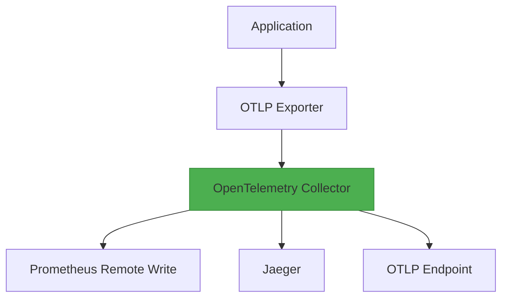

## Installation and Setup

The OpenTelemetry Collector is a critical component in observability pipelines, aggregating and processing telemetry data from applications and services. This section guides you through installing and configuring the Collector on various platforms, ensuring it is ready to collect, process, and export traces, metrics, and logs.

---

### Installation Methods

#### 1. **Docker**
The Docker method is ideal for quick deployment and testing. Pull the official image and run the Collector with a configuration file:

```bash
docker pull otelcol/otelcol
docker run --rm -v $(pwd)/config.yaml:/etc/otelcol/config.yaml -p 13133:13133 otelcol/otelcol --config /etc/otelcol/config.yaml
```

Replace `config.yaml` with your actual configuration file. The Collector will expose metrics on port `13133` by default.

#### 2. **Package Managers**
Install via your OS's package manager. For example, on Ubuntu/Debian:

```bash
sudo apt-get install -y apt-transport-https
curl -sSL https://raw.githubusercontent.com/open-telemetry/opentelemetry-collector-releases/main/installer.sh | sh
```

On macOS with Homebrew:

```bash
brew install opentelemetry-collector
```

#### 3. **Source Build**
For developers, build from source using Go:

```bash
go get github.com/open-telemetry/opentelemetry-collector
cd $GOPATH/src/github.com/open-telemetry/opentelemetry-collector
make build
```

Run the binary with a configuration file:

```bash
./otelcol --config config.yaml
```

---

### Configuration

The Collector uses a YAML configuration file (`config.yaml`) to define pipelines, exporters, and processors. A basic example:

```yaml
service:
  pipelines:
    traces:
      receivers: [otlp]
      processors: [batch]
      exporters: [prometheusremotewrite, jaeger]
    metrics:
      receivers: [otlp]
      exporters: [prometheusremotewrite]
```

**Key Configuration Elements:**
- **Receivers**: Define how the Collector accepts data (e.g., `otlp`, `prometheus`).
- **Processors**: Transform or filter data (e.g., `batch`, `resourcedetection`).
- **Exporters**: Specify where to send data (e.g., `prometheusremotewrite`, `otlp`).

**Configuration File Location:**
- Linux/macOS: `/etc/otelcol/` or `~/.config/otelcol/`
- Windows: `C:\Users\<User>\.config\otelcol\`

**Validation:**
Test your config with:

```bash
otelcol configcheck --config config.yaml
```

---

### Platform-Specific Notes

| Platform       | Notes                                                                 |
|----------------|----------------------------------------------------------------------|
| **Linux**      | Use `systemd` or `init.d` to manage the service. Example systemd unit file: |
|                | `[Unit]`<br>`Description=OpenTelemetry Collector`<br>`[Service]`<br>`ExecStart=/usr/local/bin/otelcol --config /etc/otelcol/config.yaml` |
| **macOS**      | Homebrew installs the binary to `/usr/local/bin/otelcol`.          |
| **Windows**    | MSI install places binaries in `C:\Program Files\OpenTelemetry Collector`. |
| **Cloud**      | Use container registries (e.g., Docker Hub) or serverless functions. |

---

### Diagram: Collector Architecture



---

## Key takeaways
- **Installation**: Choose Docker, package managers, or source builds based on your environment.
- **Configuration**: Define receivers, processors, and exporters in `config.yaml` to tailor data flow.
- **Validation**: Use `otelcol configcheck` to ensure your config is syntactically correct.
- **Platform Adaptation**: Adjust installation steps for Linux, macOS, Windows, or cloud environments.
