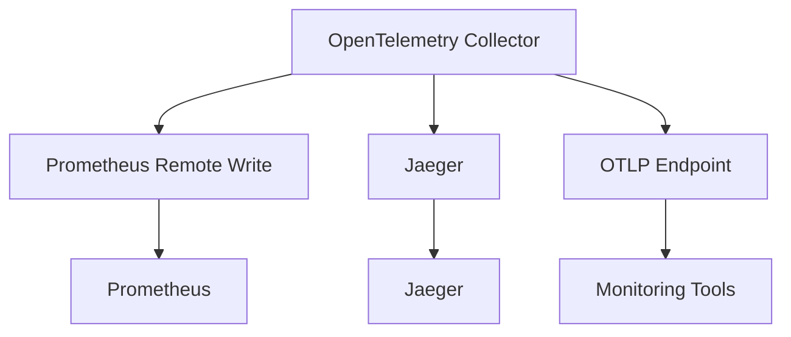

The OpenTelemetry Collector acts as a central hub for aggregating, processing, and exporting telemetry data to monitoring tools. By configuring the Collector's exporters, you can route metrics, logs, and traces to platforms like Prometheus, Jaeger, and Grafana. This section details how to set up these integrations, including configuration examples and best practices.

---

## Exporting to Prometheus

Prometheus is a popular time-series database that can consume metrics via the Prometheus Remote Write protocol. The OpenTelemetry Collector provides a `prometheusremotewrite` exporter for this purpose.

### Configuration Example
```yaml
exporters:
  prometheusremotewrite:
    endpoint: http://prometheus-server:9090
    headers:
      X-Scope-Inherit: "true"
    timeout: 10s
```

### Key Parameters
- **endpoint**: The URL of your Prometheus server (e.g., `http://localhost:9090`).
- **headers**: Optional headers for authentication or metadata. The `X-Scope-Inherit` header is recommended for propagating trace context.
- **timeout**: Maximum time to wait for a write request.

### Example Command
```bash
otelcol-contrib --config=collector-config.yaml --exporter prometheusremotewrite
```

---

## Exporting to Jaeger

Jaeger is a distributed tracing system that accepts traces via the Jaeger Thrift protocol. The Collector's `jaeger` exporter routes traces to a Jaeger instance.

### Configuration Example
```yaml
exporters:
  jaeger:
    endpoint: http://jaeger-collector:14268/api/traces
    headers:
      jaeger-version: "1.0"
    timeout: 5s
```

### Key Parameters
- **endpoint**: The Jaeger collector's HTTP endpoint (e.g., `http://jaeger-collector:14268/api/traces`).
- **headers**: Metadata for the request, such as the Jaeger version.
- **timeout**: Maximum time to wait for a trace ingestion request.

### Example Command
```bash
otelcol-contrib --config=collector-config.yaml --exporter jaeger
```

---

## Exporting to Grafana (via Prometheus)

Grafana can visualize metrics from Prometheus, which acts as an intermediary. Configure the Collector to export to Prometheus, then connect Grafana to the Prometheus datasource.

### Configuration Example
```yaml
exporters:
  prometheusremotewrite:
    endpoint: http://prometheus-server:9090
    headers:
      X-Scope-Inherit: "true"
    timeout: 10s
```

### Grafana Setup
1. Add a Prometheus datasource in Grafana, pointing to your Prometheus server.
2. Use Prometheus queries to visualize metrics from the Collector.

---

## Exporting to OTLP Endpoint (Universal Protocol)

The OpenTelemetry Protocol (OTLP) is a universal format supported by most observability tools. Configure the Collector to expose an OTLP endpoint for consumption by tools like Lightstep, Tempo, or custom receivers.

### Configuration Example
```yaml
exporters:
  otlp:
    endpoint: http://otel-collector:4317
    headers:
      authorization: "Bearer <token>"
    timeout: 5s
```

### Key Parameters
- **endpoint**: The OTLP endpoint URL (e.g., `http://otel-collector:4317` for gRPC or `http://otel-collector:4318` for HTTP).
- **headers**: Authentication tokens or custom headers.
- **timeout**: Maximum time to wait for a request.

---

## Diagram: Collector Exporter Architecture


---

## Key takeaways
- Use the `prometheusremotewrite` exporter for metrics to Prometheus.
- Use the `jaeger` exporter for trace data to Jaeger.
- Leverage the OTLP endpoint for universal compatibility with observability tools.
- Always configure authentication, timeouts, and headers to ensure reliability.
- Connect Grafana to Prometheus for visualizing metrics exported by the Collector.
