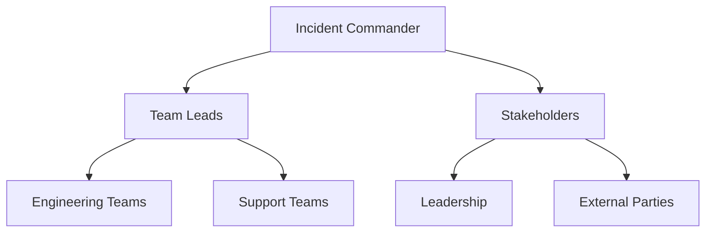
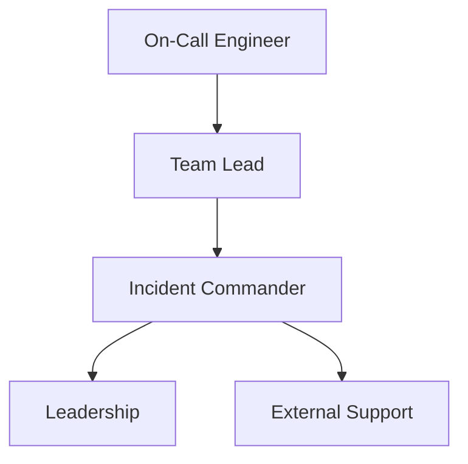

## Incident Command Structure  

During outages, a well-defined incident command structure ensures rapid, coordinated responses while minimizing confusion and delays. This structure establishes clear roles, escalation paths, and decision-making hierarchies to maintain control and accountability. Below is a breakdown of key components and practices.  

---

### Incident Commander (IC)  
The **Incident Commander** is the primary decision-maker during an outage, responsible for orchestrating the response and ensuring alignment with organizational goals. Key responsibilities include:  
- **Triage and prioritization**: Assessing the severity of the incident and determining resource allocation.  
- **Communication**: Maintaining transparency with stakeholders, including engineering teams, leadership, and external parties.  
- **Escalation decisions**: Determining when to involve higher-level leaders or external support.  
- **Post-incident review**: Leading the analysis to identify root causes and prevent recurrence.  

**Example**:  
```bash
# Command to trigger incident escalation (hypothetical tool)  
escalate_incident --level=2 --incident-id=INC-12345  
```  

**Diagram**:  


---

### Escalation Protocols  
Escalation protocols define when and how incidents are escalated to higher authority or external teams. These protocols should be documented and tested regularly. Common escalation levels include:  

| Level | Trigger | Action |  
|-------|---------|--------|  
| 1 | Minor outage (e.g., 5% SLI degradation) | Notify on-call engineer |  
| 2 | Major outage (e.g., 25% SLI degradation) | Notify team lead and escalate to IC |  
| 3 | Critical outage (e.g., 50% SLI degradation) | Escalate to leadership and external support |  

**Example**:  
```bash
# Escalation rule in a monitoring tool (e.g., Prometheus + Alertmanager)  
- alert: CriticalOutage  
  expr: (sum by (service) (job_failure_count)) > 10  
  for: 5m  
  labels:  
    severity: critical  
  annotations:  
    summary: "Critical outage detected: {{ $labels.service }}"  
    description: "Escalate to leadership and external support."  
```  

**Diagram**:  


---

### Decision-Making Hierarchies  
A clear hierarchy ensures decisions are made efficiently without bottlenecks. Key principles include:  
1. **Delegation**: Team leads handle tactical decisions (e.g., troubleshooting), while the IC focuses on strategic decisions (e.g., resource allocation).  
2. **Runbooks**: Standardized procedures guide decisions at each level to reduce ambiguity.  
3. **Authority boundaries**: Engineers are empowered to make decisions within their domain, but the IC retains final authority for high-impact actions.  

**Example**:  
```bash
# Runbook snippet for resolving a database outage  
1. Verify primary DB status using `pg_isready`  
2. If unreachable, attempt failover to standby node  
3. If unresolved, escalate to DBA team (within 15 minutes)  
4. If unresolved after 30 minutes, notify IC for broader intervention  
```  

---

### Documentation and Post-Incident Reviews  
Incident command structures must include mechanisms for documenting decisions and outcomes. This includes:  
- **Real-time logs**: Capturing actions taken during the incident.  
- **Post-incident reviews (PIRs)**: Analyzing root causes, communication effectiveness, and lessons learned.  

**Example**:  
```bash
# Command to generate a post-incident report (hypothetical tool)  
generate_report --incident-id=INC-12345 --format=markdown  
```  

---

## Key takeaways  
- **Clear roles** (e.g., Incident Commander, team leads) prevent confusion and ensure accountability.  
- **Predefined escalation paths** enable rapid response without delays.  
- **Decision-making hierarchies** balance autonomy with oversight to avoid bottlenecks.  
- **Documentation and PIRs** are critical for continuous improvement and learning.
